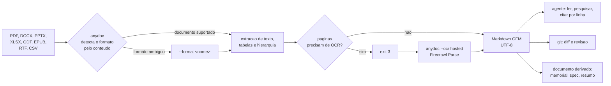
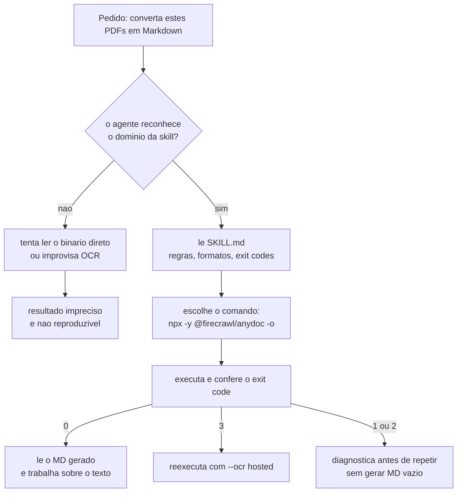

# anydoc

Conversor de documentos para **Markdown (GFM)** com uma skill de agente acoplada: Word (`.doc`, `.docx`, `.docm`), PowerPoint (`.ppt`, `.pps`, `.pot`, `.pptx`, `.pptm`, `.ppsx`, `.ppsm`), Excel (`.xls`, `.xlsx`, `.xlsm`, `.xlsb`), OpenDocument (`.odt`, `.ods`, `.odp`), RTF, EPUB, CSV e PDF.

O objetivo do projeto é simples: **entregar ao modelo o conteúdo do documento, não uma imagem dele.** Um `.pdf` ou `.docx` é um contêiner binário opaco para o agente; convertido em Markdown, o mesmo material passa a ser texto UTF-8 que pode ser lido por faixa de linhas, pesquisado, comparado em `diff` e versionado no Git.

---

## Por que Markdown e não PDF / DOCX / PPTX

A maioria dos fluxos com agentes falha menos por falta de capacidade do modelo e mais por **economia de contexto**: o agente precisa gastar janela para descobrir onde está a informação, e janela gasta em representação não é janela gasta em raciocínio.

| Critério | Anexar o original (PDF/DOCX/PPTX) | Converter para Markdown |
|---|---|---|
| Legibilidade pelo modelo | Nenhuma direta — exige rasterização/OCR antes que qualquer token seja útil | Direta: texto UTF-8 tokenizado como qualquer arquivo do projeto |
| Custo por sessão | Alto e **recorrente** — cada página rasterizada vira imagem e consome tokens de visão a cada nova sessão | Pago **uma vez** na conversão e depois reaproveitado do repositório |
| Estrutura | Recuperada por heurística de layout; tabelas e hierarquia frequentemente embaralhadas | Preservada: `#` headings, tabelas GFM, listas e blocos de código |
| Acesso parcial | Difícil: o anexo é lido como um bloco inteiro ou como páginas arbitrárias | Precisa: dá para ler só a seção relevante por faixa de linhas ou `grep` |
| Verificabilidade | Saída não determinística entre leituras | Determinística, auditável e citável com número de linha |
| Versionamento | Binário: o Git guarda uma cópia nova a cada alteração, sem diff útil | Texto: `git diff` mostra exatamente o que mudou no documento |
| Automação | Requer pilha de OCR/parsers em cada máquina | CLI com códigos de saída, pronto para script e CI |

> [!TIP]
> Regra prática: **documento é insumo de repositório, não anexo de conversa.** Converta uma vez, versione o `.md` ao lado do original e deixe o agente ler o texto sempre que precisar — sem repetir o custo de leitura em cada sessão.

### Como isso se traduz em janela de contexto

```mermaid
flowchart TB
  subgraph A["Caminho A - anexar o original"]
    A1["PDF de 69 paginas<br/>4,5 MB"] --> A2["cliente rasteriza<br/>as paginas como imagem"]
    A2 --> A3["custo de visao por pagina,<br/>repetido a cada sessao"]
    A3 --> A4["tabelas embaralhadas,<br/>OCR impreciso em simbolos e unidades"]
  end
  subgraph B["Caminho B - converter para Markdown"]
    B1["PDF de 69 paginas<br/>4,5 MB"] --> B2["anydoc, uma vez<br/>sem OCR se houver camada de texto"]
    B2 --> B3["48 KB de texto<br/>ordem de 12k tokens"]
    B3 --> B4["leitura por faixa de linhas,<br/>pesquisa e citacao exata de linha"]
    B4 --> B5["artefato derivado<br/>revisado e versionado"]
  end
```



O ganho não está em "comprimir bytes" — está em trocar uma representação que o modelo só consegue **estimar** por uma que ele consegue **consultar**.

---

## Como funciona



O binário detecta o formato **pelo conteúdo**, não pela extensão. Isso significa que um `.pdf` renomeado continua sendo tratado como PDF e que a extensão errada não causa erro de conversão.

---

## Instalação

### Pré-requisitos

- **Node.js 20 ou superior** (o pacote usa recursos recentes de runtime).
- Nenhuma dependência de sistema: o `anydoc` não requer LibreOffice, Poppler ou binários externos.

```bash
node --version   # deve responder v20.x ou superior
```

> [!NOTE]
> Verificado neste workspace com Node `v22.23.2` e npm `12.0.2`.

### Opção 1 — sem instalar (recomendada para uso pontual)

Via `npx`, o pacote é baixado em cache na primeira execução e reutilizado depois:

```bash
npx -y @firecrawl/anydoc documento.pdf -o documento.md
```

### Opção 2 — instalação global

Para uso frequente ou em scripts, instale uma vez e invoque `anydoc` diretamente:

```bash
sudo npm install -g @firecrawl/anydoc
```

Confirme que o binário está no `PATH`:

```bash
which anydoc
anydoc documento.pdf -o documento.md
```

> [!WARNING]
> `sudo npm install -g` grava no prefixo global do Node. Em ambientes gerenciados por `nvm`, prefira `npm install -g` sem `sudo` dentro do ambiente virtual — evita arquivos de sistema com dono `root` e conflitos de versão.

### Instalação da skill

A skill ensina o agente **quando** converter e **como** chamar a CLI, em vez de tentar interpretar o binário por conta própria:

```bash
npx skills add firecrawl/anydoc
```

---

## Uso

### Formas de invocação

```bash
# Markdown para a saída padrão
npx -y @firecrawl/anydoc <arquivo>

# Gravar em arquivo (preferido para documentos grandes)
npx -y @firecrawl/anydoc <arquivo> -o saida.md

# Ler da entrada padrão (exige --format, não há como detectar)
npx -y @firecrawl/anydoc - --format csv < dados.csv
```

`anydoc` e `npx -y @firecrawl/anydoc` são equivalentes após a instalação global — use a forma curta nos scripts.

### Formatos suportados

| Família | Extensões |
|---|---|
| Word | `.doc`, `.docx`, `.docm` |
| OpenDocument | `.odt`, `.ods`, `.odp` |
| RTF | `.rtf` |
| EPUB | `.epub` |
| PDF | `.pdf` |
| PowerPoint | `.ppt`, `.pps`, `.pot`, `.pptx`, `.pptm`, `.ppsx`, `.ppsm` |
| Excel | `.xls`, `.xlsx`, `.xlsm`, `.xlsb` |
| CSV | `.csv` |

### Códigos de saída

| Código | Significado | Ação |
|---|---|---|
| `0` | Sucesso | — |
| `1` | O documento não pôde ser convertido | Verificar se o arquivo não está corrompido ou protegido |
| `2` | Erro de uso | Revisar argumentos e o valor de `--format` |
| `3` | Páginas do PDF precisam de OCR | Reexecutar com `--ocr hosted` |

Falhas imprimem **uma única linha** `anydoc: <mensagem>` em `stderr`. A CLI **nunca** abre prompt interativo, o que a torna segura em pipelines, tarefas agendadas e agentes.

### Páginas escaneadas e OCR

Documentos sem camada de texto (digitalizações, páginas só de imagem) retornam `exit 3` em vez de produzir Markdown vazio — o erro é explícito para não gerar um `.md` enganoso.

```bash
# Envia o documento para o Firecrawl Parse (não exige cadastro)
anydoc digitalizado.pdf -o digitalizado.md --ocr hosted

# Limites maiores com chave de API
export FIRECRAWL_API_KEY="fc-..."
anydoc digitalizado.pdf -o digitalizado.md --ocr hosted
```

Também é possível passar a chave por `--api-key`. O modo `hosted` envia o arquivo para o serviço de parsing da Firecrawl ([firecrawl.dev/parse](https://firecrawl.dev/parse)) — avalie a política de dados da sua organização antes de usá-lo com material sensível.

### Boas práticas

- **Documentos grandes:** sempre `-o arquivo.md` e leia depois apenas as seções necessárias. Despejar um manual inteiro na saída padrão só faz sentido para arquivos pequenos.
- **`--format` é exceção:** só use quando a detecção não puder funcionar (CSV pela entrada padrão, extensão ausente ou incorreta).
- **Dentro de uma base de código:** em projetos Node, Python ou Rust, prefira a biblioteca à execução da CLI. Os pacotes `@firecrawl/anydoc` (npm), `firecrawl-anydoc` (PyPI) e `anydoc` (crates.io) expõem a mesma API `toMarkdown` / `to_markdown`.
- **Preserve o original:** mantenha o binário ao lado do `.md` gerado — a conversão prioriza texto e estrutura, e diagramas vetoriais ou esquemáticos perdem posicionamento.

---

## Usando a skill

A skill `convert-documents-to-markdown` é o contrato entre o agente e a CLI. Sem ela, o modelo tende a tentar ler o PDF diretamente ou a improvisar uma pilha de OCR; com ela, ele sabe que existe uma ferramenta determinística com códigos de saída definidos.



### Onde a skill fica

```bash
npx skills add firecrawl/anydoc
```

Isso grava a skill no workspace e registra a origem no `skills-lock.json`:

```json
{
  "version": 1,
  "skills": {
    "convert-documents-to-markdown": {
      "source": "firecrawl/anydoc",
      "sourceType": "github",
      "skillPath": "skills/convert-documents-to-markdown/SKILL.md",
      "computedHash": "f5cf8f73b291fd0e29adb9a762dcda267245b44ffbdabc3321771aac1c41fb11"
    }
  }
}
```

Estrutura resultante:

```text
.agents/skills/convert-documents-to-markdown/SKILL.md   # nucleo: regras de uso da CLI
skills-lock.json                                        # origem e hash da skill
```

O `computedHash` é o que permite detectar quando a skill publicada mudou: rode `npx skills add firecrawl/anydoc` novamente para atualizar.

### Como o agente decide usá-la

1. O pedido é classificado pelo domínio: "preciso do conteúdo deste `.docx`", "resuma este PDF", "extraia a tabela desta planilha".
2. O agente lê o `SKILL.md`, que descreve os formatos suportados, as formas de invocação e os códigos de saída.
3. Antes de converter em lote, ele resolve ambiguidades: qual arquivo, para onde escrever o `.md` e se o original deve ser preservado.
4. A conversão é executada e o **código de saída é conferido** — `exit 3` significa OCR, não falha de permissão.
5. Só o Markdown é levado ao contexto; o binário permanece no repositório como fonte da verdade.

> [!IMPORTANT]
> A skill não substitui `--ocr hosted`: ela **informa que o OCR existe e quando usar**. Se o documento é uma digitalização, a decisão de enviá-lo a um serviço externo continua sendo do usuário.

---

## Estudo de caso — nó LoRaWAN Dragino LSN50 v2

Cenário real deste repositório: três PDFs de fornecedor sobre um nó sensor LoRaWAN precisavam virar **memorial técnico** que servisse de base para projetar um dispositivo próprio (hardware, firmware, payload e ensaios).

### Insumos

| Documento | Páginas | Tamanho do PDF | Papel |
|---|---|---|---|
| `LSN50_LoRa_Sensor_Node_UserManual_v1.7.4.pdf` | 69 | 4,55 MB | Manual do usuário: pinagem, modos de operação, payload, energia |
| `DRAGINO_LSN50_AT_Commands_v1.6.3.pdf` | 24 | 508 KB | Conjunto de comandos AT, com valores padrão e respostas |
| `LoRa ST Sensor Node v2.0.sch.pdf` | 1 | 64 KB | Esquemático elétrico (PDF vetorial) |
| **Total** | **94** | **5,13 MB** | |

### Resultado da conversão

| Markdown gerado | Tamanho | Palavras | Linhas de tabela | Headings |
|---|---|---|---|---|
| `LSN50_..._UserManual_v1.7.4.md` | 48,3 KB | 7.316 | 162 | 94 |
| `DRAGINO_LSN50_AT_Commands_v1.6.3.md` | 24,2 KB | 2.798 | 233 | 7 |
| `LoRa ST Sensor Node v2.0.sch.md` | 2,1 KB | 216 | 40 | 0 |
| **Total** | **74,6 KB** | **10.330** | **435** | **101** |

Nenhum arquivo exigiu OCR: os três PDFs tinham camada de texto, então as 94 páginas saíram com `exit 0` na primeira tentativa.

### Artefato derivado

`docs/memorial.txt` — 1.360 linhas, ~72 KB, 18 seções:

- especificação de hardware (MCU, rádio, mapa de 30 pinos, circuito de potência, proteções);
- payloads dos 6 modos de operação, byte a byte, com regras de decodificação;
- tabela completa de comandos AT com valores padrão e códigos de status;
- perfil LoRaWAN e mapas de canais US915 / AU915 / CN470;
- orçamento de energia e autonomia de bateria;
- 12 requisitos funcionais, 10 não funcionais e arquitetura de software proposta;
- plano de ensaios com critérios de aceitação, 12 riscos e 5 anexos.

### Artefato derivado — engenharia reversa do firmware

`docs/re/firmware-lsn50-v1.8.1-au915.md` — extraído por análise estática de
`FIRMWARE/LSN50_AU915_v1.8.1.hex` (imagem **mais nova** que os manuais disponíveis). Não é conversão de
documento: é desmontagem Thumb/Cortex‑M0+ (Capstone), grafo de chamadas e leitura dirigida do código.

| Artefato | Conteúdo |
|---|---|
| `docs/re/firmware-lsn50-v1.8.1-au915.md` | lógica do firmware: mapa de memória, 604 funções, laço principal, payload dos 9 modos, parser AT, downlink, EEPROM, plano AU915, guia de recodificação |
| `docs/re/at-commands.csv` | as **61** entradas da tabela de comandos AT, com endereço de entrada e os 4 ponteiros de handler |
| `docs/re/functions-map.csv` | inventário das 604 funções com papel inferido, strings, periféricos e globais de RAM |
| `docs/re/tools/` | pipeline reprodutível (HEX → binário → desmontagem anotada → tabelas) |

Achados que **contradizem ou ampliam** os manuais de referência: modo de trabalho 1..9 (não 1..6),
três entradas de interrupção (PB14/PB15/PA4), payload de 17 bytes no MOD9 (acima do limite de DR0 em
AU915), byte 7 sem os bits de modo no MOD1, e o campo de peso do MOD5 gravado em ordem b0/b3/b2.

### O que funcionou e o que não funcionou

**Funcionou bem**

- **Tabelas sobreviveram.** O manual tem changelog, pinagem, payloads e mapas de canais em formato tabular; 435 linhas de tabela foram preservadas como GFM, mantendo a associação entre coluna e valor.
- **Citação precisa.** Com o `.md` no repositório, cada afirmação do memorial pôde ser ancorada em documento e seção (`[R1 §2.3.1]`), e o agente pôde reler apenas o trecho necessário.
- **Consumo previsível.** Os ~75 KB de Markdown representam uma fração pequena da janela de contexto, mesmo somando o memorial derivado.

**Não funcionou bem**

- **Esquemático elétrico.** O PDF vetorial de 1 página virou 40 linhas de tabela desestruturada: os rótulos de rede e nomes de componente aparecem, mas **sem posicionamento**. A conversão serve como índice de sinais, não como substituto do circuito — por isso, no memorial, todo valor de componente derivado do esquemático está marcado como "confirmar no PDF original".
- **Números e unidades em colunas próximas.** Em trechos com tabelas muito densas, a extração juntou rótulos de linhas vizinhas; qualquer dado crítico deve ser conferido contra o original.

> [!TIP]
> Conclusão prática do caso: **converta para Markdown o que é texto, mantenha o PDF para o que é geometria.** Manuais, comandos AT e planilhas ganham muito; diagramas, esquemáticos e plantas perdem informação e devem permanecer como original.

---

## Comandos usados no estudo de caso

Conversão dos PDFs do diretório `Node-Dragino - LSN50v2/`, gravando um `.md` ao lado de cada original:

```bash
cd "Node-Dragino - LSN50v2"

for f in *.pdf; do
  out="${f%.pdf}.md"
  echo "=== $f -> $out"
  npx -y @firecrawl/anydoc "$f" -o "$out"
  echo "exit=$?"
done

ls -la *.md
```

Os três arquivos retornaram `exit=0`. Para converter um arquivo específico:

```bash
anydoc "LSN50_LoRa_Sensor_Node_UserManual_v1.7.4.pdf" \
  -o "LSN50_LoRa_Sensor_Node_UserManual_v1.7.4.md"
```

Inspeção dos resultados e conferência de estrutura antes de alimentar o contexto:

```bash
wc -l *.md                       # volume por arquivo
grep -c '^|' *.md                # linhas de tabela preservadas
grep -c '^#' *.md                # hierarquia de headings
```

---

## Solução de problemas

| Sintoma | Causa provável | Correção |
|---|---|---|
| `exit 3` | Páginas sem camada de texto (digitalização) | `anydoc <arquivo> -o <saida>.md --ocr hosted` |
| `exit 2` | Argumentos inválidos ou `--format` incompatível | Revisar a linha de comando; usar `--format` apenas quando a detecção não puder funcionar |
| `exit 1` | Arquivo corrompido, protegido por senha ou não suportado | Confirmar a integridade do original e se o formato está na lista de suportados |
| Markdown gerado vazio ou quase vazio | PDF só de imagens **ou** extensão errada induzindo o parser | Tentar `--ocr hosted`; se for outro formato, informar `--format` |
| CSV pela entrada padrão falha | Não há conteúdo para detecção | `anydoc - --format csv < dados.csv` |
| `anydoc: command not found` | Instalação global ausente ou fora do `PATH` | Usar `npx -y @firecrawl/anydoc` ou corrigir o prefixo global do npm |
| Tabelas fora de ordem | Layout denso do documento original | Conferir os dados críticos no original; considerar converter apenas as seções necessárias |

---

## Referências

- Skill `convert-documents-to-markdown` — `.agents/skills/convert-documents-to-markdown/SKILL.md`
- Firecrawl Parse (OCR hospedado) — [firecrawl.dev/parse](https://firecrawl.dev/parse)
- Estudo de caso — `docs/memorial.txt`
- Originais e Markdown convertidos — `Node-Dragino - LSN50v2/`

