# Memorial descritivo e técnico — nó sensor LoRaWAN (dispositivo novo)

**Finalidade.** Descrever a **lógica de funcionamento** de um nó sensor LoRaWAN a ser implementado do zero. O documento é **autocontido**: protocolo de aplicação, interface de configuração, persistência, ciclo de execução, requisitos e critérios de aceitação estão todos aqui.

**Derivação.** Todo o comportamento descrito foi extraído por engenharia reversa do firmware da plataforma
de referência. A rastreabilidade é feita ao documento de análise:

| Fonte | Papel |
|---|---|
| `docs/re/firmware-lsn50-v1.8.1-au915.md` | Lógica do firmware de referência: endereços, estruturas, formatos, algoritmos |
| `docs/re/at-commands.csv` | Tabela de comandos AT observada no binário (61 entradas) |
| `docs/re/functions-map.csv` | 604 funções com tamanho, chamadores, strings e papel inferido |
| `docs/memorial.txt` | Memorial da plataforma de referência — consulta |

**Convenção de confiança usada nas afirmações:**

- **[V]** — verificado no binário de referência (endereço citado no documento de análise);
- **[I]** — inferido por padrão de código/constante;
- **[A]** — decisão em aberto, consolidada na §20 e a fechar antes do congelamento.

**Fora de escopo deste documento.** Identidade e nomenclatura de produto, numeração de versão, invólucro,
projeto mecânico, embalagem, etiquetagem e certificação regulatória. O objeto aqui é a **lógica de
operação e os requisitos de firmware**.

---

## Sumário

1. Conceito de operação
2. Ciclo de vida e máquina de estados
3. Arquitetura de software
4. Ciclo principal (executivo cíclico)
5. Camada de aquisição de sensores
6. Modelo de dados da amostra
7. Payload de uplink — modos de trabalho
8. Regra de admissão de tamanho por data rate
9. Interface local de configuração (AT)
10. Configuração remota (downlink)
11. Persistência e ciclo de vida da configuração
12. Eventos, contadores e entradas digitais
13. Rede LoRaWAN
14. Energia
15. Diagnóstico e observabilidade
16. Requisitos funcionais
17. Requisitos não funcionais
18. Ordem de implementação sugerida
19. Critérios de aceitação
20. Decisões em aberto
21. Anexos (tabela AT completa, layouts, estruturas, glossário)

---

## 1. Conceito de operação

### 1.1 Arquitetura do sistema

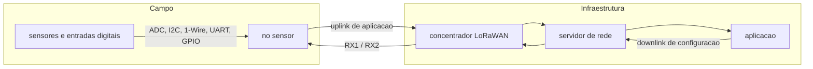

O nó é um **coletor autônomo**: adquire grandezas físicas, codifica em um payload compacto, transmite por
LoRaWAN e aceita reconfiguração remota. Não há dependência de um coletor local nem de gateway dedicado.

### 1.2 Papel das três interfaces do dispositivo

| Interface | Sentido | Função |
|---|---|---|
| Rádio LoRaWAN | bidirecional | Telemetria (uplink) e configuração remota (downlink) |
| Console serial local | bidirecional | Comissionamento e diagnóstico por comandos AT |
| Barramento de sensores | entrada | Aquisição das grandezas, incluindo entradas digitais de evento |

### 1.3 Princípios de projeto herdados da análise

1. **Nada bloqueia.** Todo trabalho é uma etapa verificada por flag dentro de um único laço; nenhum caminho
   de código espera por rádio, sensor ou console. **[V]** (`0x080124D6`)
2. **Um único caminho de transmissão.** Monta-se o payload, deposita-se no descritor de aplicação e emite-se
   um evento à pilha de rede — não existem caminhos paralelos de envio. **[V]** (`0x08008A38`)
3. **Uma única função de aquisição.** A leitura consolidada de sensores serve simultaneamente ao uplink e ao
   comando de leitura sob demanda; isso garante que console e rádio nunca divirjam. **[V]** (`0x08001B10`)
4. **Escalas e ordenação fixas.** Um decodificador externo deve poder interpretar o payload sem estado extra.
5. **Baixo consumo como requisito, não como otimização.** O laço entra em baixo consumo a cada volta. **[V]**
   (`0x08008ACC`)

### 1.4 Contexto de dimensionamento medido na referência

| Grandeza | Valor observado | Uso como piso de projeto |
|---|---|---|
| Imagem de firmware | 88.976 B de 192 KB de flash | Orçamento de código + tabelas de texto |
| RAM | 20 KB (652 B de dados + 6.964 B de BSS) | Orçamento de estado global e *stacks* |
| Memória não volátil de dados | ~6 KB mapeada | Parâmetros, chaves e contadores |
| Funções identificadas | 604, cobrindo 88.608 B | Repartição de esforço (§3.3) |

---

## 2. Ciclo de vida e máquina de estados

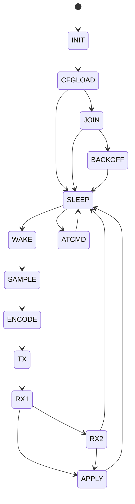

| Estado | O que acontece | Condição de saída |
|---|---|---|
| `INIT` | Inicialização de clock, GPIO, temporizadores, ADC e console | Periféricos prontos |
| `CFGLOAD` | Carrega configuração da memória não volátil; se virgem, aplica padrões de fábrica; imprime identificação | Configuração em RAM |
| `JOIN` | Procedimento de ativação na rede | Sessão estabelecida ou falha |
| `BACKOFF` | Espera crescente antes de nova tentativa de ativação | Expiração do temporizador |
| `SLEEP` | Baixo consumo com temporizadores ativos; aceita comandos AT | Timer de cadência, evento digital ou comando |
| `WAKE` | Saída do baixo consumo, alimentação do trilho de sensores | Trilho estabilizado |
| `SAMPLE` | Aquisição de todas as grandezas do modo configurado | Amostra preenchida |
| `ENCODE` | Codificação do payload conforme o modo de trabalho | Buffer de aplicação pronto |
| `TX` | Transmissão do uplink e abertura das janelas de recepção | Fim da transmissão |
| `RX1` / `RX2` | Janelas de recepção conforme o perfil de rede | Downlink recebido ou janela expirada |
| `APPLY` | Validação e aplicação da configuração recebida | Configuração persistida |
| `ATCMD` | Processamento de uma linha de comando do console | Resposta emitida |

**Modos de disparo do ciclo de amostragem e envio** — o dispositivo precisa suportar três origens
independentes de uplink, todas convergindo para o mesmo caminho de transmissão:

| Modo | Origem | Observação |
|---|---|---|
| Periódico | Temporizador de cadência | Intervalo configurável, com piso mínimo de proteção |
| Por evento digital | Mudança de estado em qualquer entrada digital monitorada | Detecção por borda |
| Por interrupção contabilizada | Limiar de contagem de pulsos em entrada dedicada | Envia o acumulado |
| Comandado | Comando de console de envio manual | Para bancada e diagnóstico |

---

## 3. Arquitetura de software

### 3.1 Módulos e dependências

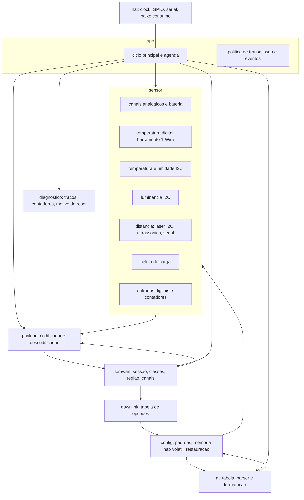

**Regra estrutural:** as dependências são unidirecionais no sentido `app → payload → lorawan` e
`at/downlink → config`. Nenhum driver de sensor conhece a pilha de rede; nenhum tratador de comando AT
realiza aquisição diretamente — ambos passam pela função consolidada de leitura (§5.5).

### 3.2 Contratos entre módulos

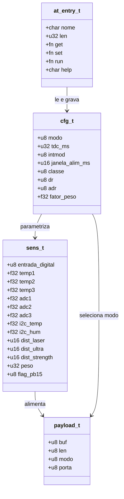

| Produtor | Consumidor | Contrato |
|---|---|---|
| Sensores | Codificador de payload | `sens_t` preenchida e normalizada em unidades de engenharia |
| Configuração | Codificador de payload | Modo de trabalho (1..9) define layout e comprimento |
| Codificador | Pilha de rede | Descritor `{ponteiro, comprimento, tipo de evento, porta}` |
| Pilha de rede | Descodificador de downlink | `payload[0]` é opcode; restante são argumentos |
| Downlink | Configuração | Gravação validada + marcação de pendência de reinício |
| Tabela AT | Configuração e sensores | Um accessor por campo, sem escrita direta no estado |

### 3.3 Repartição de esforço observada (artefato de dimensionamento)

Agregação do mapa de funções da referência (`docs/re/functions-map.csv`) por faixa de endereço — usada
como **orçamento de referência** para o novo firmware:

| Faixa de módulo | Funções | Bytes | Fatia |
|---|--:|--:|--:|
| Runtime de compilador (libc, aritmética de ponto flutuante) | 57 | 4.464 | 5,0 % |
| Drivers de sensor | 42 | 7.700 | 8,7 % |
| Persistência e parâmetros | 21 | 3.284 | 3,7 % |
| HAL de periféricos e temporizadores | 122 | 14.332 | 16,2 % |
| Inicialização de periféricos, serial, DMA e ADC | 45 | 3.620 | 4,1 % |
| Pilha LoRaWAN (MAC, região, criptografia) | 163 | 27.920 | 31,5 % |
| Aplicação (ciclo, payload, sensores) | 73 | 12.278 | 13,9 % |
| AT, configuração e serviços | 66 | 6.006 | 6,8 % |
| Console serial e GPIO de sensor | 14 | 1.104 | 1,2 % |
| Tabelas de comandos, textos de ajuda e descritores | 1 | 7.900 | 8,9 % |
| **Total** | **604** | **88.608** | **100 %** |

**Leituras que orientam a recodificação:**

- A **pilha de rede domina** (~1/3 do código). É o candidato natural a reúso de implementação consagrada em
  vez de escrita do zero.
- **~9 % da imagem são textos de ajuda e tabelas de descritores.** No novo firmware esse custo deve ser
  tratado como dado versionado e revisado, não como literal em código (§17, RNF-13).
- **Aplicação + sensores somam ~23 %.** É essa a parte que efetivamente precisa ser especificada em detalhe —
  e é o objeto principal deste memorial.

### 3.4 Interface do console com o estado

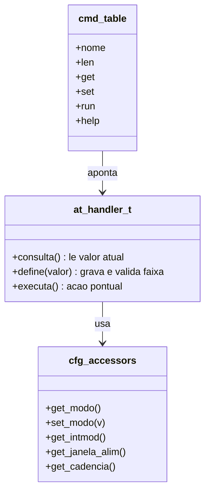

Cada campo de configuração exposto ao console tem **par dedicado de acesso** (leitura e gravação), e o
tratador de comando apenas valida e delega. Isso elimina escrita direta em variáveis globais e é o padrão a
manter.

---

## 4. Ciclo principal (executivo cíclico)

### 4.1 Fluxo reconstruído

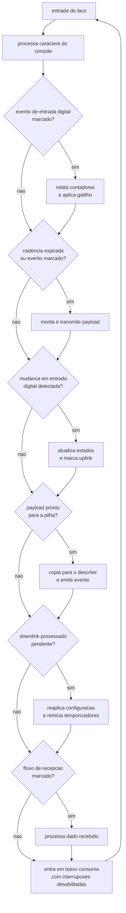

### 4.2 Tabela de sinais internos do laço

Cada etapa é acionada por um sinal booleano no estado da aplicação. A tabela reproduz os sinais efetivamente
observados **[V]** (estado base `0x20000094`), com a nomenclatura proposta para o novo firmware:

| Offset observado | Sinal proposto | Disparado por | Consumido por |
|---|---|---|---|
| `+0x00` | `payload_len` | Codificador | Cópia para o descritor da pilha |
| `+0x01..03` | `entrada_estado[3]` | Aquisição | Detecção de borda |
| `+0x07` | `marcar_leitura_entradas` | Flag externo | Força nova leitura das entradas digitais |
| `+0x08` | `payload_buf[]` | Codificador | Descritor da pilha |
| `+0x0B` | `estado_pos_processamento` | Laço | Escolha do atraso pós-evento |
| `+0x0C` | `marcar_processar_rx` | Pilha de rede | Fluxo de recepção |
| `+0x0E` | `marcar_relatar_contadores` | Interrupção | Relatório de contadores |
| `+0x0F` | `marcar_pulso_programado` | Temporizador | Pulso em saída de controle |
| `+0x11` | `tx_em_andamento` | Dispatcher | Trava de reentrância de transmissão |
| `+0x12` | `marcar_troca_classe` | Console/downlink | Reconfiguração de classe |
| `+0x13` | `marcar_reenvio` | Laço | Reenvio de quadro |
| `+0x16` | `config_pendente_reaplicar` | Downlink | Reaplicação completa de configuração |
| `+0x17` | `config_alterada` | Console/downlink | Persistência e aviso de reinício |
| `+0x19` | `marcar_uplink` | Cadência, evento, comando | Entrada no codificador |
| `+0x1B` | `payload_pronto` | Codificador | Cópia para o descritor |
| `+0x1C` | `marcar_tx_auxiliar` | Laço | Fluxo auxiliar de transmissão |
| `+0x2E` | `bateria_mv` | ADC | Todo payload |
| `+0x40` / `+0x44` | `contador1` / `contador2` | Interrupções | Modos de contagem e relatório |

**Requisito de arquitetura:** o novo firmware deve manter a propriedade de que **nenhum sinal é consumido
por dois contextos ao mesmo tempo** e que todo sinal é auto-limpante ao ser atendido. O uso de um único
ponto de entrada do laço é o que torna o temporizador de watchdog seguro.

### 4.3 Ordem de verificação observada na referência

Para preservar o comportamento, a ordem de atendimento deve ser mantida **[V]**:

1. console (processamento de caractere recebido);
2. pulso programado;
3. troca de classe;
4. reaplicação de configuração pendente;
5. relatório de contadores / eventos de interrupção;
6. transmissão de uplink;
7. leitura e comparação das entradas digitais;
8. entrega do payload à pilha;
9. fluxo auxiliar de transmissão;
10. reenvio;
11. fluxo de recepção;
12. entrada em baixo consumo.

---

## 5. Camada de aquisição de sensores

### 5.1 Classes de sensor suportadas

| Classe funcional | Interface | Grandeza | Papel no payload |
|---|---|---|---|
| Canal analógico 1 | ADC | tensão (mV) | Campo principal de vários modos |
| Canais analógicos 2 e 3 | ADC | tensão (mV) | Modos de 3 canais |
| Bateria | ADC interno, divisor | tensão (mV) | Presente em **todo** uplink |
| Temperatura digital 1..3 | Barramento 1-Wire por software | °C, décimos | Modos de temperatura |
| Temperatura e umidade ambiente | I2C | °C / %RH, décimos | Modo padrão |
| Luminância | I2C | lux | Alternativa de modo padrão |
| Distância a laser | I2C | mm | Modo de distância |
| Distância ultrassônica | GPIO com medição de eco | cm | Modo de distância |
| Distância por sensor serial | UART dedicada | cm + intensidade | Modo de distância |
| Célula de carga | ADC de ponte com ganho | g | Modo de peso |
| Entradas digitais | GPIO | 0/1 | Flag de estado no payload |

### 5.2 Detecção na inicialização

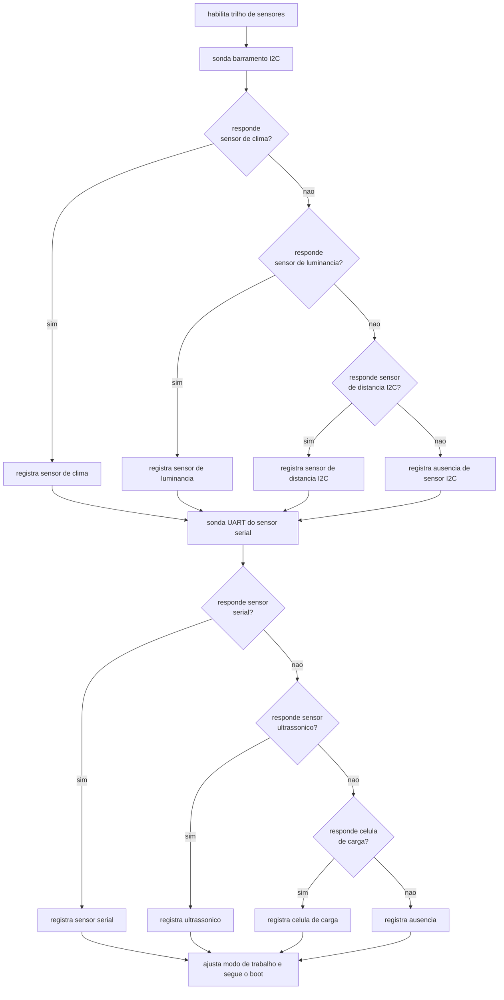

Pontos de comportamento a preservar **[V]** (`0x0800179C`):

- a detecção ocorre **no boot**, antes do laço, e o resultado é impresso no console;
- o trilho dos sensores é energizado **antes** da sondagem e há atraso de estabilização;
- o modo de trabalho é ajustado automaticamente quando o sensor detectado difere do modo configurado;
- a ausência de sensor **não impede o boot**: o dispositivo entra em operação com campos inválidos
  sinalizados, não com falha.

### 5.3 Trilho de alimentação dos sensores

| Aspecto | Comportamento observado | Diretriz para o novo firmware |
|---|---|---|
| Pino de controle | Saída digital dedicada ao trilho de sensores **[V]** (`0x08012F3C`) | Um único ponto de controle, com polaridade em constante nomeada |
| Janela de energização | Habilitado antes da aquisição; tempo estendido por parâmetro (ms) **[V]** | Manter parâmetro configurável e valor mínimo de estabilização |
| Ponto de uso | Chamado no boot e **antes de cada ciclo** de amostragem | Nunca amostrar com o trilho recém-energizado |
| Polaridade efetiva | O código de referência deixa o pino em nível alto antes da amostragem **[V]** (`0x08012F72`), mas a documentação da plataforma declara nível baixo como habilitador **[A]** | Confirmar em bancada e fixar em **um único** `#define` (RNF-16) |

### 5.4 Estrutura da amostra

A estrutura de aquisição tem **0x34 bytes** e é preenchida uma única vez por ciclo, em buffer de pilha
**[V]**:

| Offset | Tipo | Grandeza | Unidade |
|---|---|---|---|
| `+0x00` | `u8` | entrada digital | 0/1 |
| `+0x04` | `f32` | temperatura 1 | °C |
| `+0x08` | `f32` | temperatura 2 | °C |
| `+0x0C` | `f32` | temperatura 3 | °C |
| `+0x10` | `f32` | analógico 1 | mV |
| `+0x14` | `f32` | analógico 2 | mV |
| `+0x18` | `f32` | analógico 3 | mV |
| `+0x1C` | `f32` | temperatura ambiente I2C | °C |
| `+0x20` | `f32` | umidade ambiente I2C (ou luminância) | %RH / lux |
| `+0x24` | `u16` | distância por sensor I2C | mm |
| `+0x26` | `u16` | distância por ultrassônico ou serial | cm |
| `+0x28` | `u16` | intensidade de sinal do sensor serial | adimensional |
| `+0x2C` | `u32` | peso | g |
| `+0x30` | `u8` | flag de atividade da entrada 2 | 0/1 |

**Convenção obrigatória:** os drivers de sensor entrepõem valores **em unidade de engenharia** (`float`);
qualquer conversão para unidade de transmissão acontece **exclusivamente** no codificador de payload. Isso
evita duplicação de escalas e é o que permite a mesma amostra servir ao console e ao rádio.

### 5.5 Função consolidada de leitura

Existe **uma única** rotina que percorre todos os sensores, converte e formata o resultado textual
**[V]** (`0x08001B10`, 909 instruções). Ela é chamada por:

- o codificador de payload (via estrutura de amostra);
- o comando de console de leitura sob demanda, que **imprime** os valores e **não** transmite **[V]**
  (`0x080116F0`).

Campos textuais observados na rotina: `Bat`, `temperatura 1`, `temperatura e umidade ambiente`,
`analógico 1`, `distância ultrassônica`, `distância e intensidade serial`, `peso`, `contador 1`,
`contador 2`, além do estado das três entradas digitais. **[V]**

**Requisito:** o novo firmware mantém essa unicidade. Um único ponto de aquisição, um único ponto de
formatação textual, consumidos por dois clientes.

---

## 6. Modelo de dados da amostra e escalas

### 6.1 Conversão e escalas de transmissão

| Grandeza | Conversão aplicada antes de transmitir | Formato no payload |
|---|---|---|
| Bateria | leitura direta em mV | `u16` |
| Temperatura | valor em °C × 10 | `i16` com sinal |
| Umidade | valor em %RH × 10 | `i16` com sinal |
| Luminância | conforme sensor | `i16` |
| Analógico | valor em mV, inteiro | `u16` |
| Distância | conforme sensor | `u16` |
| Peso | conforme calibração | `i32` |
| Contador de eventos | sem conversão | `u32` |

A multiplicação por 10 e a conversão para inteiro são visíveis no binário de referência (`fmul` com
constante 10,0 seguido de conversão *float→int*) **[V]**.

### 6.2 Regra de ordenação

**Todo campo multi-byte é codificado em big-endian**, MSB primeiro **[V]** — o padrão aparece repetido em
todos os montadores e nos campos de contador de 32 bits.

### 6.3 Regra de valor inválido

Campo sem leitura válida deve ser sinalizado por **valor sentinela documentado**, nunca por omissão ou por
zero. O código de referência usa `0xFF 0xFF` em um dos campos de distância quando o sensor ativo não fornece
aquela grandeza **[V]** (`0x0800E39C`).

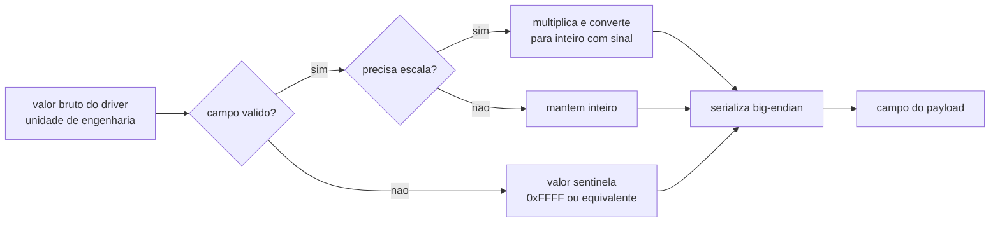

---

## 7. Payload de uplink — modos de trabalho

### 7.1 Regras gerais

| Regra | Definição |
|---|---|
| Ordenação | Big-endian em todos os campos multi-byte |
| Porta de aplicação | Configurável; porta dedicada ao uplink periódico |
| Comprimento | Determinado pelo modo de trabalho, não por campo de tamanho no payload |
| Identificação do modo | Presente nos bits 2..6 do byte de estado, **exceto no modo 1** (§7.3) |
| Bateria | Sempre nos dois primeiros bytes |
| Tipo de evento da pilha | Distinto entre uplink de aplicação e tráfego de sessão/MAC |

### 7.2 Byte de estado (byte 7 de todos os modos)

```c
byte[6] = (estado_entrada_1 << 7)          // bit 7 - nivel da entrada de interrupcao 1
        | (entrada_digital   << 1)         // bit 1 - nivel da entrada digital
        | (sensor_I2C_presente & 1)        // bit 0 - presenca de sensor no barramento I2C
        | ((modo - 1) << 2)                // bits 2..6 - identificador do modo de trabalho
```

Máscara efetivamente aplicada por modo **[V]**:

| Modo | Máscara OR | Índice em `bits2..6` |
|--:|:--:|--:|
| 1 | — | 0 |
| 2 | `0x04` | 1 |
| 3 | `0x08` | 2 |
| 4 | `0x0C` | 3 |
| 5 | `0x10` | 4 |
| 6 | `0x14` | 5 |
| 7 | `0x18` | 6 |
| 8 | `0x1C` | 7 |
| 9 | `0x20` | 8 |

Duas ressalvas **herdadas e deliberadamente corrigidas** no novo firmware:

- **[A]** no modo 1 a máscara é zero, ou seja, o payload não carrega o identificador do modo. No novo
  firmware o modo deve estar **sempre** declarado (RNF-09, RF-07).
- **[A]** o bit 0 depende do identificador do sensor I2C e não é um flag genérico. Deve ser documentado
  explicitamente junto ao decodificador.

### 7.3 Layouts por modo

#### Modo 1 — ambiente I2C (11 bytes)

| Bytes | Campo |
|---|---|
| 0‑1 | Bateria (mV) |
| 2‑3 | Temperatura 1 × 10 |
| 4‑5 | Analógico 1 (mV) |
| 6 | Byte de estado |
| 7‑8 | Temperatura ambiente × 10 |
| 9‑10 | Umidade ambiente × 10 |

#### Modo 2 — distância (11 bytes)

| Bytes | Campo |
|---|---|
| 0‑1 | Bateria (mV) |
| 2‑3 | Temperatura 1 × 10 |
| 4‑5 | Analógico 1 (mV) |
| 6 | Byte de estado |
| 7‑8 | Distância |
| 9‑10 | Intensidade, ou `0xFFFF` quando o sensor ativo não fornece intensidade |

#### Modo 3 — três canais analógicos + ambiente I2C (**12 bytes**)

| Bytes | Campo |
|---|---|
| 0‑1 | Analógico 1 (mV) |
| 2‑3 | Analógico 2 (mV) |
| 4‑5 | Analógico 3 (mV) |
| 6 | Byte de estado |
| 7‑8 | Temperatura ambiente × 10 |
| 9‑10 | Umidade ambiente × 10 |
| 11 | Bateria (1 byte, LSB) |

> Este é o **primeiro modo que ultrapassa 11 bytes**. Ver §8.

#### Modo 4 — três temperaturas digitais (11 bytes)

| Bytes | Campo |
|---|---|
| 0‑1 | Bateria (mV) |
| 2‑3 | Temperatura 1 × 10 |
| 4‑5 | Analógico 1 (mV) |
| 6 | Byte de estado |
| 7‑8 | Temperatura 2 × 10 |
| 9‑10 | Temperatura 3 × 10 |

#### Modo 5 — célula de carga (11 bytes)

| Bytes | Campo |
|---|---|
| 0‑1 | Bateria (mV) |
| 2‑3 | Temperatura 1 × 10 |
| 4‑5 | Analógico 1 (mV) |
| 6 | Byte de estado |
| 7 | `0x00` |
| 8‑10 | Peso |

> **Anomalia da referência.** O binário emite o peso como **b0, b3, b2** — ordem não canônica e incompatível
> com decodificadores que esperam 16 bits nos bytes 8‑9 **[V]**. No novo firmware o peso deve ser `i16`
> big-endian nos bytes 8‑9, e a divergência registrada como decisão explícita (§20, A2).

#### Modo 6 — contagem (11 bytes)

| Bytes | Campo |
|---|---|
| 0‑1 | Bateria (mV) |
| 2‑3 | Temperatura 1 × 10 |
| 4‑5 | Analógico 1 (mV) |
| 6 | `(entrada_digital << 1) \| 0x14` — **sem** o bit da entrada de interrupção 1 |
| 7‑10 | Contador 1, `u32` big-endian |

#### Modo 7 — estado das entradas digitais (11 bytes)

| Bytes | Campo |
|---|---|
| 0‑1 | Bateria (mV) |
| 2‑3 | Temperatura 1 × 10 |
| 4‑5 | Analógico 1 (mV) |
| 6 | Byte de estado |
| 7 | `(flag_entrada_2 << 4) \| estado_entrada_2` |
| 8 | `(flag_entrada_3 << 4) \| estado_entrada_3` |
| 9 | `0xFF` |

#### Modo 8 — três analógicos + ambiente (11 bytes)

| Bytes | Campo |
|---|---|
| 0‑1 | Bateria (mV) |
| 2‑3 | Temperatura 1 × 10 |
| 4‑5 | Analógico 1 (mV) |
| 6 | Byte de estado |
| 7‑8 | Analógico 2 (mV) |
| 9‑10 | Analógico 3 (mV) |

#### Modo 9 — três temperaturas + dois contadores (**17 bytes**)

| Bytes | Campo |
|---|---|
| 0‑1 | Bateria (mV) |
| 2‑3 | Temperatura 1 × 10 |
| 4‑5 | Temperatura 2 × 10 |
| 6 | Byte de estado |
| 7‑8 | Temperatura 3 × 10 |
| 9‑12 | Contador 1, `u32` big-endian |
| 13‑16 | Contador 2, `u32` big-endian |

### 7.4 Tabela consolidada

| Modo | Uso | Bytes | Máscara no byte de estado | Sequência de campos |
|--:|---|--:|:--:|---|
| 1 | Ambiente I2C | 11 | — | BAT, T1, ADC, EST, TI2C, HI2C |
| 2 | Distância | 11 | `0x04` | BAT, T1, ADC, EST, DIST, INT |
| 3 | Três analógicos + I2C | **12** | `0x08` | ADC1, ADC2, ADC3, EST, TI2C, HI2C, BAT¹ |
| 4 | Três temperaturas | 11 | `0x0C` | BAT, T1, ADC, EST, T2, T3 |
| 5 | Célula de carga | 11 | `0x10` | BAT, T1, ADC, EST, 00, PESO |
| 6 | Contagem | 11 | `0x14` | BAT, T1, ADC, EST, CONT1(4) |
| 7 | Entradas digitais | 11 | `0x18` | BAT, T1, ADC, EST, E2, E3, FF |
| 8 | Três analógicos | 11 | `0x1C` | BAT, T1, ADC1, EST, ADC2, ADC3 |
| 9 | Temperaturas + contadores | **17** | `0x20` | BAT, T1, T2, EST, T3, CONT1(4), CONT2(4) |

¹ no modo 3 a bateria é o **último** byte e tem 1 byte apenas.

### 7.5 Pipeline de codificação


---

## 8. Regra de admissão de tamanho por data rate

O limite de carga útil do LoRaWAN **varia com o data rate**. Nos data rates mais baixos das bandas
sub-GHz de 900 MHz o limite é de **11 bytes**; nos mais altos ele cresce bastante.

| Situação | Modos afetados | Consequência |
|---|---|---|
| Payload ≤ 11 bytes | 1, 2, 4, 5, 6, 7, 8 | Compatível com o data rate mais baixo |
| Payload > 11 bytes | 3 (12 B) e 9 (17 B) | Exige data rate ≥ 1 ou ocorre perda silenciosa |

**Requisito (bloqueante para o novo firmware).** A camada de aplicação deve **consultar o data rate corrente
antes de transmitir** e:

1. escolher automaticamente um data rate suficiente para o payload; **ou**
2. truncar de forma explícita, sinalizando o truncamento no próprio payload (bit de flag dedicado); **ou**
3. recusar o envio com status de erro no console.

Transmitir em silêncio um payload maior que o limite **não é aceitável**: o servidor recebe quadro vazio ou
truncado, e a falha é invisível no dispositivo. Esse é o principal risco identificado na plataforma de
referência **[V]**.

---

## 9. Interface local de configuração (AT)

### 9.1 Transporte

| Parâmetro | Valor |
|---|---|
| Porta | Serial assíncrona dedicada ao console |
| Formato de linha | 8 bits de dados, sem paridade, 1 bit de parada |
| Controle de fluxo | Nenhum |
| Velocidade | Fixa e documentada, igual à usada pelo console de referência |
| Terminador de linha | `<CR>`, `<LF>` ou `<CR><LF>` |

**Comportamento obrigatório:** a linha **só é processada ao receber o terminador**. É a causa mais comum de
"o dispositivo não responde" durante o comissionamento. O console deve ser usado com `Enter` configurado para
sufixar `CR`, `LF` ou `CR+LF`. **[V]** (`0x08002444`)

### 9.2 Gramática — quatro formas

```text
AT                       -> erro + ajuda geral
AT?                      -> ajuda de todos os comandos
AT+CMD?                  -> ajuda curta do comando
AT+CMD=?                 -> consulta o valor atual
AT+CMD=<valor>           -> grava o valor (com validacao de faixa)
AT+CMD                   -> executa a acao pontual
```

Formato de resposta: `<valor><CR><LF><CR><LF><Status>`, com o campo `<valor>` presente apenas nos casos de
ajuda e de consulta.

### 9.3 Fluxo do parser

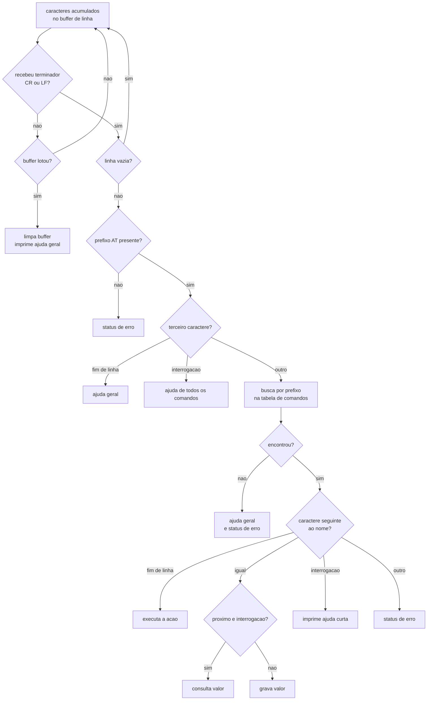

Atalhos de console a implementar **[V]**:

| Entrada | Efeito |
|---|---|
| `Ctrl-A` | Limpa a linha corrente e imprime a ajuda geral |
| `DEL` / `0x7F` | Limpa a linha corrente e imprime a ajuda curta |
| Limite de linha | 127 caracteres; ao exceder, limpa e imprime ajuda |

### 9.4 Estrutura da tabela de comandos

```c
/* Entrada da tabela de comandos AT - 24 bytes cada */
typedef struct {
    const char *nome;        /* +0x00  nome sem o prefixo "AT"        */
    uint32_t    len;         /* +0x04  comprimento, usado na busca    */
    void      (*get)(void);  /* +0x08  AT+CMD=?   consulta            */
    void      (*set)(void);  /* +0x0C  AT+CMD=<v> gravacao            */
    void      (*run)(void);  /* +0x10  AT+CMD     acao                */
    const char *help;        /* +0x14  AT+CMD?    ajuda curta         */
} at_entry_t;
```

**Regras a preservar:**

- a busca é por **prefixo do nome**, comparando `len` caracteres — o que torna a ordem da tabela relevante
  quando um nome é prefixo de outro;
- um mesmo endereço de função pode ocupar vários campos (usado, por exemplo, para consulta e execução no
  mesmo comando) **[V]**;
- a ausência de tratador é representada por um **stub neutro único**, e não por ponteiro nulo **[V]**;
- a ajuda completa de cada comando vive fora da estrutura, referenciada por ponteiro.

### 9.5 Distribuição de capacidades na tabela observada

| Capacidade | Quantidade |
|---|--:|
| Comandos na tabela | 61 |
| Com consulta (`=?`) | 50 |
| Com gravação (`=`) | 48 |
| Com execução (sem argumento) | 8 |
| Consulta **e** gravação | 43 |
| Somente consulta | 7 |
| Somente gravação | 5 |
| Somente execução | 6 |

### 9.6 Classes funcionais dos comandos

| Classe | Finalidade | Exemplos |
|---|---|---|
| Identificação e controle | Identificação, ajuda, reinício, restauração de padrões, modo verboso | `AT`, `AT?`, `ATZ`, `AT+VER`, `AT+CFG`, `AT+DEBUG`, `AT+FDR` |
| Identidade e chaves | EUIs, endereço de dispositivo, chaves de sessão e de aplicação | `AT+DEUI`, `AT+APPEUI`, `AT+APPKEY`, `AT+DADDR`, `AT+NWKSKEY`, `AT+APPSKEY`, `AT+NWKID` |
| Sessão e junção | Modo de ativação, comando de junção, estado, contadores de quadro | `AT+NJM`, `AT+JOIN`, `AT+NJS`, `AT+FCU`, `AT+FCD` |
| Rádio e canais | ADR, potência, data rate, duty cycle, frequências e data rate das janelas, atrasos de janela, classe, canal único, sub-banda, dwell time, tempo de espera das janelas, número máximo de transmissões, verificações de segurança de quadro | `AT+ADR`, `AT+TXP`, `AT+DR`, `AT+DCS`, `AT+PNM`, `AT+RX2FQ`, `AT+RX2DR`, `AT+RX1DL`, `AT+RX2DL`, `AT+JN1DL`, `AT+JN2DL`, `AT+CLASS`, `AT+CHS`, `AT+CHE`, `AT+DWELLT`, `AT+RX1WTO`, `AT+RX2WTO`, `AT+SETMAXNBTRANS`, `AT+DISFCNTCHECK`, `AT+DISMACANS`, `AT+RPL`, `AT+RJTDC`, `AT+DECRYPT`, `AT+RXDATEST`, `AT+DDETECT` |
| Envio e recepção manual | Envio de texto e de hexadecimal, leitura do último recebido, confirmação, porta | `AT+SENDB`, `AT+SEND`, `AT+RECVB`, `AT+RECV`, `AT+CFM`, `AT+CFS`, `AT+PORT` |
| Aplicação e sensores | Cadência, modo de trabalho, gatilhos de interrupção, janela do trilho de sensores, calibração de peso, contador, leitura sob demanda, qualidade de rádio | `AT+TDC`, `AT+MOD`, `AT+INTMOD1`, `AT+INTMOD2`, `AT+INTMOD3`, `AT+5VT`, `AT+WEIGRE`, `AT+WEIGAP`, `AT+SETCNT`, `AT+GETSENSORVALUE`, `AT+SNR`, `AT+RSSI` |

A relação completa, com nome exato e formas suportadas por comando, está na §21.1.

### 9.7 Códigos de status

| Status | Significado | Uso |
|---|---|---|
| `OK` | Comando executado sem erro | Resposta de sucesso |
| `AT_ERROR` | Erro genérico | Sintaxe inválida, comando desconhecido |
| `AT_PARAM_ERROR` | Parâmetro inválido | Fora de faixa |
| `AT_PARAM_ERROR(Incorrect Length)` | Comprimento inválido | Lista de bytes com tamanho errado |
| `AT_BUSY_ERROR` | Rede ocupada / comando não concluído | Recurso indisponível |
| `AT_TEST_PARAM_OVERFLOW` | Parâmetro longo demais | Buffer excedido |
| `AT_NO_NETWORK_JOINED` | Sem sessão válida | Comando que exige rede |
| `AT_RX_ERROR` | Erro na recepção do comando | Falha de parsing |

---

## 10. Configuração remota (downlink)

### 10.1 Caminho de recepção

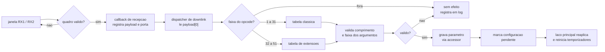

**Requisito de isolamento:** o tratador de downlink **não** executa aquisição de sensores nem transmissão.
Ele apenas grava parâmetro, marca pendência e retorna. Todo trabalho pesado acontece no laço principal
**[V]** (`0x0800845C` → `0x200000AA` → `0x08012534`).

### 10.2 Organização da tabela de opcodes

A referência usa **dois blocos** de opcodes **[V]**:

| Bloco | Faixa | Característica |
|---|---|---|
| Clássico | `0x01` … `0x1F` | Cada opcode tem significado fixo; os argumentos têm comprimento implícito |
| Estendido | `0x20` … `0x33` | Cada opcode valida explicitamente comprimento e faixa dos argumentos |

Opcodes clássicos com significado confirmado **[V]**:

| Opcode | Argumentos | Equivalência AT | Efeito |
|---|---|---|---|
| `0x0A` | `aa` | `AT+MOD=aa` | Modo de trabalho |
| `0x06` | `aa bb` | `AT+INTMODx` | Gatilho de interrupção |
| `0x07` | `aa bb` | `AT+5VT=aabb` | Janela do trilho de sensores (ms) |
| `0x08 01` | — | `AT+WEIGRE` | Zera a calibração de peso |
| `0x08 02` | `aa bb` | `AT+WEIGAP` | Fator de calibração de peso |

Extensões do bloco superior com validação observada **[V]**:

| Opcode | Validação | Efeito |
|---|---|---|
| `0x20` | comprimento 2; argumento 0/1 | Parâmetro booleano |
| `0x21` | comprimento 2; argumento ≤ 5 | Parâmetro de rádio |
| `0x22` | comprimento 2 ou 4 | Parâmetro de 1 ou 2 bytes |
| `0x23` | comprimento 2 | Modo de trabalho, com validação |
| `0x24` | comprimento 2; argumento ≤ 9 | Parâmetro de aplicação |
| `0x25` | comprimento 2; argumento 0/1 | Flag booleano |
| `0x26` | comprimento 2 ou 3 | Conjunto de flags |
| `0x32` | comprimento 6 | Parâmetros múltiplos (6 bytes) |
| `0x33` | — | Ramo específico |

### 10.3 Requisitos da tabela de downlink

1. **Tabela explícita e versionada.** Opcode de 1 byte, comprimentos e faixas declarados como dado, não como
   cadeia de comparações em código.
2. **Validação antes de aplicar.** Comprimento e faixa verificados; entrada inválida não altera estado e não
   trava.
3. **Aplicação em memória não volátil.** Parâmetro aceito por downlink sobrevive a reinício.
4. **Pendência de reinício sinalizada.** Configuração que só tem efeito após reinício deve responder com
   aviso explícito, como fazem os comandos locais equivalentes **[V]**.
5. **Confirmação opcional.** Comandos críticos devem poder ser confirmados pela aplicação.
6. **Registro do último downlink.** Porta, comprimento e conteúdo devem ser consultáveis pelo console.

---

## 11. Persistência e ciclo de vida da configuração

### 11.1 O que é persistido

| Grupo | Conteúdo | Frequência de escrita |
|---|---|---|
| Identidade e chaves | EUIs, endereço, chaves de aplicação e de sessão, identificador de rede | Rara (comissionamento) |
| Sessão | Contadores de quadro de uplink e downlink, contexto de sessão | A cada transmissão (contador) |
| Aplicação | Modo de trabalho, cadência, porta, gatilhos de interrupção, janela do trilho, calibração de peso | Eventual |
| Rádio | Classe, ADR, data rate, sub-banda, potência, atrasos de janela | Eventual |
| Contadores de evento | Acumulados de 32 bits | Por evento/lote |
| Diagnóstico | Motivo do último reset | Por boot |

### 11.2 Modelo de armazenamento proposto

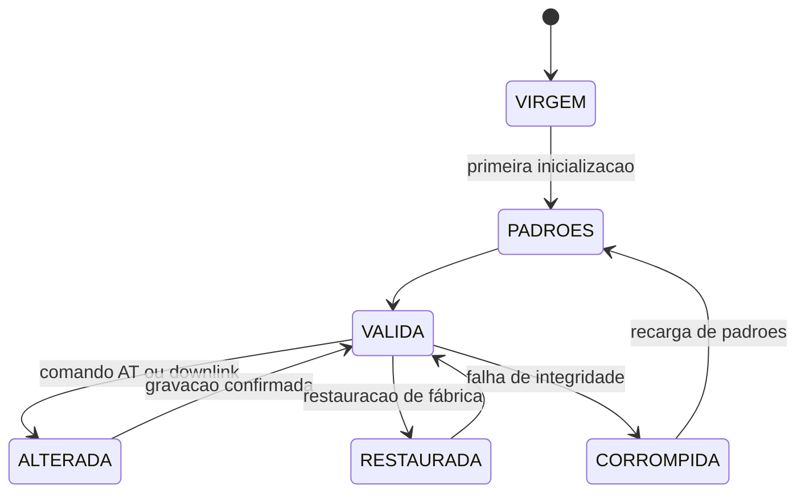

**Requisitos do bloco persistente:**

| Requisito | Justificativa |
|---|---|
| Cabeçalho com identificação de formato | Permite evoluir o layout sem ambiguidade |
| Verificação de integridade por CRC | Detecta bloco parcialmente gravado por queda de energia |
| Cópia de segurança alternada | Permite recuperar o bloco anterior se a gravação falhar |
| Contador de ciclos de escrita | Suporta *wear leveling* e alerta de desgaste |
| Separação entre bloco de chaves e bloco de parâmetros | Permite restaurar padrões preservando chaves |
| Detecção de dispositivo virgem | Primeira inicialização aplica padrões sem intervenção |

A referência usa a memória não volátil mapeada **sem driver de emulação**, com pelo menos três blocos
distintos, e decide a aplicação dos padrões de fábrica pela leitura das primeiras palavras **[V]**. O
**layout interno** dos blocos ficou **[A]** — recomenda-se **substituir por um layout versionado com CRC**
em vez de reproduzir o formato antigo.

### 11.3 Restauração de padrões de fábrica

**Requisito explícito:** a restauração de padrões de fábrica **preserva as chaves**, exatamente como o
comando de referência declara no próprio texto de ajuda **["Keys Reserve"]** **[V]**. Isso é o que permite
recuperar um dispositivo em campo sem perder o vínculo com o servidor.

### 11.4 Pendência de reinício

Parâmetros que não podem ser alterados em tempo de execução devem:

1. ser gravados na memória não volátil;
2. responder com **aviso explícito** de que terão efeito após reinício **[V]**;
3. deixar o estado atual intocado até que o reinício ocorra.

---

## 12. Eventos, contadores e entradas digitais

### 12.1 Entradas digitais

| Entrada | Papel | Uso no payload |
|---|---|---|
| Entrada digital | Estado lógico geral | Bit 1 do byte de estado |
| Entrada de interrupção 1 | Contagem de pulsos e disparo de uplink por borda | Bit 7 do byte de estado; contador 1 |
| Entrada de interrupção 2 | Contagem de pulsos e detecção de borda | Mapa dedicado (modo 7); contador 2 |
| Entrada de interrupção 3 | Detecção de borda | Mapa dedicado (modo 7) |

A referência expõe **três** entradas de interrupção configuráveis, cada uma com seu próprio vetor de
interrupção e o modo de gatilho configurável (desabilitado, ambas as bordas, borda de descida, borda de
subida), com validação de faixa e aviso de que a alteração só tem efeito após reinício **[V]**.

### 12.2 Contadores

| Contador | Largura | Zerável por comando | Enviado em |
|---|--:|:--:|---|
| Contador 1 | 32 bits | Sim | Modos 6 e 9 |
| Contador 2 | 32 bits | Sim | Modo 9 |

### 12.3 Estratégia de detecção — duas vias complementares

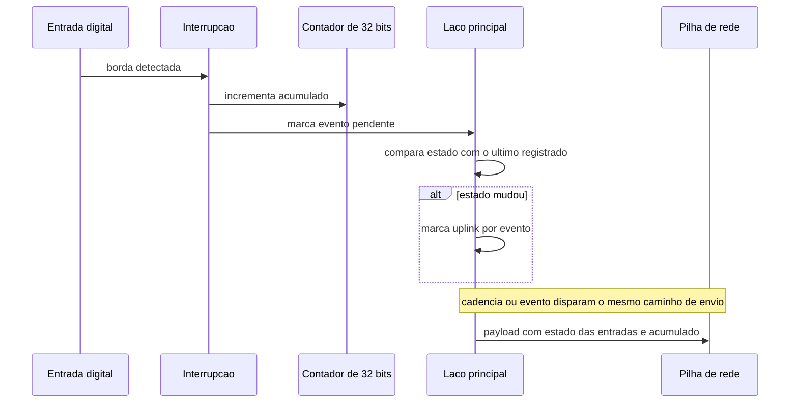

O dispositivo usa **as duas vias**: interrupção por hardware alimenta os contadores (não perde pulsos curtos)
e a **leitura por comparação no laço** detecta mudança de nível e dispara o uplink **[V]**. Manter as duas é
o requisito; escolher apenas uma implica perder pulsos ou perder o evento de borda.

### 12.4 Modo de contagem

O modo de contagem transmite, a cada ciclo, o **acumulado** dos contadores — não o incremento. Requisito
para o servidor: o acumulado é monotonamente crescente e o servidor calcula a diferença. O acumulado deve
sobreviver a reinício.

---

## 13. Rede LoRaWAN

### 13.1 Ativação e classes

| Item | Requisito |
|---|---|
| Modos de ativação | Ativação pelo ar (padrão) e sessão previamente estabelecida (ABP) |
| Classes | Classe A como padrão; Classe C suportada como opção |
| Junção | Comando local de junção e junção automática após a inicialização |
| Backoff | Tentativas de junção com intervalo crescente |
| Rejunção periódica | Intervalo configurável, com validação de faixa |
| Estado de junção | Consultável pelo console |

### 13.2 Região e canais

| Item | Requisito |
|---|---|
| Região | **Selecionável em tempo de compilação**, não em tempo de execução **[V]** |
| Sub-banda | Seleção de sub-banda para regiões que usam múltiplos bancos de canais, com validação de faixa |
| Canal único | Modo de canal único com frequência configurável, para gateways de um canal |
| Canal duplo de recepção | Frequência e data rate da segunda janela configuráveis |
| Tempo de ocupação | Parâmetro de *dwell time* exposto e persistido |

**Ponto de atenção:** a sub-banda e a frequência de canal único são parâmetros que **só têm efeito após
reinício**. O console deve avisar, e o firmware deve gravar a intenção antes de reiniciar **[V]**.

### 13.3 ADR e data rate

| Item | Requisito |
|---|---|
| ADR | Ligado/desligado por parâmetro, com persistência |
| Data rate manual | Só aplicável com ADR desligado; o console deve avisar **[V]** |
| Potência | Faixa numérica validada; mapa documentado |
| Número máximo de transmissões | Parâmetro de adaptação exposto e limitado |
| Registro de adaptação | Toda mudança de data rate, potência ou repetição deve ser registrada no console **[V]** |

### 13.4 Janelas de recepção e sessão

| Item | Requisito |
|---|---|
| Atrasos de RX1/RX2 | Configuráveis e persistidos |
| Atrasos de aceitação de junção | Configuráveis e persistidos |
| Tempo de espera das janelas | Configurável |
| Contadores de quadro | Persistidos, consultáveis e restauráveis por comando |
| Verificação de contador de downlink | Comutável, para tolerância a servidores sem controle de quadro |
| Respostas MAC automáticas | Comutáveis, para diagnóstico |
| Detecção de downlink | Comutável, para economizar energia quando não há tráfego de rede |
| Descriptografia do payload | Comutável, para inspeção em bancada |

### 13.5 Contratos de rádio

| Contrato | Definição |
|---|---|
| Tipo de evento de aplicação | Distinto do tráfego de sessão e MAC |
| Porta de aplicação | Definida em configuração, consultável |
| Payload | Buffer de aplicação com comprimento explícito |
| Confirmação | Modo de confirmação comutável; status do último envio consultável |

---

## 14. Energia

### 14.1 Estratégia

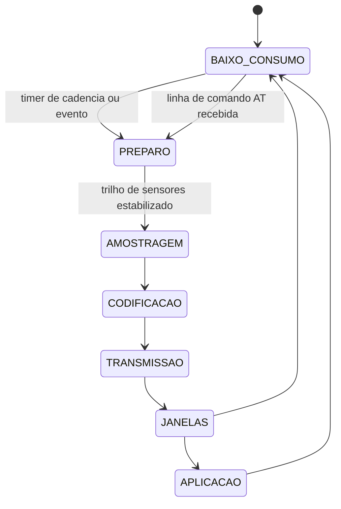

| Elemento | Requisito |
|---|---|
| Trilho permanente | Alimenta apenas o que precisa ficar ativo entre ciclos |
| Trilho comutado | Energiza o conjunto de sensores somente na janela de amostragem |
| Estabilização | Atraso mínimo obrigatório entre energizar e amostrar |
| Baixo consumo | Entrada em baixo consumo a cada volta do laço, com interrupções protegidas durante a transição **[V]** |
| Despertar | Temporizador de cadência, evento digital ou caractere recebido no console |
| Cadência mínima | Piso de proteção (a referência impõe mínimo de alguns segundos e rejeita valores menores com mensagem explícita) **[V]** |
| Redução adaptativa | Baixa bateria deve reduzir a cadência, não interromper o serviço |

### 14.2 Recomendações de robustez energética

1. Nenhum caminho de código pode aguardar resposta de sensor ou de rádio em laço ativo.
2. O watchdog deve ser alimentado no ponto único do laço principal — e nunca dentro de um driver.
3. A escrita em memória não volátil deve ocorrer **fora** da janela de amostragem, para não estender o tempo
   com o trilho energizado.
4. O relatório textual de sensores (uso de bancada) não deve ser emitido por padrão em campo.

---

## 15. Diagnóstico e observabilidade

| Recurso | Requisito |
|---|---|
| Identificação na inicialização | Imprimir no console a identificação do dispositivo e o identificador de banda/região **[V]** |
| Estado de junção | Impresso na inicialização e consultável |
| Modo verboso | Comutável por comando, para habilitar traços de uplink e de sessão **[V]** |
| Relatório de contadores | Impressão dos acumulados sob demanda **[V]** |
| Motivo do último reset | Registrado e consultável **[V]** |
| Watchdog | Habilitado, com período documentado **[V]** |
| Traço de transmissão | Número de tentativas e contador de uplink registrados a cada envio **[V]** |
| Registro do último downlink | Porta, comprimento e conteúdo consultáveis |
| Erro de sensor | Campo marcado com sentinela no payload, nunca falha de boot |

---

## 16. Requisitos funcionais

### 16.1 Aquisição

| ID | Requisito | Evidência |
|---|---|---|
| RF-01 | Adquirir, em cada ciclo, o conjunto de grandezas definido pelo modo de trabalho configurado | `0x08001B10`, `0x0800E1D8` |
| RF-02 | Alimentar o trilho dos sensores somente na janela de amostragem, com tempo de estabilização configurável | `0x08012F3C`, `0x08010334` |
| RF-03 | Detectar os sensores presentes na inicialização e ajustar o modo automaticamente, sem impedir o boot em caso de ausência | `0x0800179C` |
| RF-04 | Ler três canais analógicos e a tensão de bateria | `0x08007224`, `0x08007400` |
| RF-05 | Ler até três temperaturas digitais em barramento 1-Wire | `0x08002A60` |
| RF-06 | Ler temperatura e umidade em I2C, com alternância para sensor de luminância conforme o modo | `0x0800231C` |
| RF-07 | Ler distância por sensor I2C, por sensor ultrassônico ou por sensor serial | `0x08001B10` |
| RF-08 | Ler célula de carga com fator de calibração e comando de zeragem | `0x080119C0`, `0x08011A44` |
| RF-09 | Ler o estado de três entradas digitais de interrupção e de uma entrada digital geral | `0x08004BA4`, `0x080125EE` |
| RF-10 | Expor uma única rotina consolidada de leitura, usada tanto pelo uplink quanto pelo console | `0x08001B10` |

### 16.2 Payload

| ID | Requisito | Evidência |
|---|---|---|
| RF-11 | Codificar o payload em big-endian, com as escalas definidas na §6.1 | `0x0800E23C`…`0x0800E7BE` |
| RF-12 | Implementar os nove modos de trabalho com os layouts da §7.3 | idem |
| RF-13 | Compor o byte de estado com nível da entrada de interrupção 1, entrada digital, presença de sensor I2C e identificador do modo | §7.2 |
| RF-14 | Declarar o modo de trabalho em **todos** os modos, inclusive o modo 1 | §7.2, correção de A3 |
| RF-15 | Sinalizar campo inválido por valor sentinela documentado | `0x0800E39C` |
| RF-16 | Implementar descodificador de referência e *fixtures* byte a byte para todos os modos | §19 |
| RF-17 | Consultar o data rate antes de transmitir e recusar/ajustar payload acima do limite | §8 |

### 16.3 Transmissão e recepção

| ID | Requisito | Evidência |
|---|---|---|
| RF-18 | Enviar uplink periódico com cadência configurável, respeitando piso mínimo | `0x080112C8` |
| RF-19 | Enviar uplink por evento de mudança em qualquer entrada digital monitorada | `0x080124D6` |
| RF-20 | Enviar uplink com o acumulado dos contadores de eventos | modos 6 e 9 |
| RF-21 | Permitir envio manual de dados de aplicação em texto e em hexadecimal, com porta especificada | `0x08011165`, `0x080111FD` |
| RF-22 | Expor o último dado recebido em formato bruto e em formato hexadecimal | `0x08010F35`, `0x08010F79` |
| RF-23 | Suportar modo de confirmação e expor o status da última confirmação | `0x08011409`, `0x08011749` |
| RF-24 | Receber e aplicar configuração por downlink com validação de comprimento e faixa | `0x0800845C` |

### 16.4 Configuração

| ID | Requisito | Evidência |
|---|---|---|
| RF-25 | Implementar console serial com as quatro formas de comando | `0x08012B30` |
| RF-26 | Processar a linha somente após o terminador, com limite de 127 caracteres e atalhos de ajuda | `0x08002444` |
| RF-27 | Manter tabela de comandos com nome, comprimento, três tratadores e texto de ajuda | `0x08013E34` |
| RF-28 | Implementar ajuda geral, ajuda de todos os comandos e ajuda curta por comando | `0x08012B30` |
| RF-29 | Retornar os códigos de status da §9.7 | strings da imagem |
| RF-30 | Validar faixa de todo parâmetro gravado e rejeitar com status de erro | §9.6 |
| RF-31 | Persistir configuração em memória não volátil com verificação de integridade | `0x080030B8` |
| RF-32 | Restaurar padrões de fábrica **preservando as chaves** | `0x080109B8` |
| RF-33 | Aplicar padrões automaticamente quando a memória estiver virgem | `0x0801248C` |
| RF-34 | Avisar quando a alteração só tiver efeito após reinício | strings `Attention:...` |
| RF-35 | Permitir reinício comandado pelo console | `0x0801175C` |
| RF-36 | Imprimir todas as configurações sob demanda | `0x08010458` |

### 16.5 Eventos e contadores

| ID | Requisito | Evidência |
|---|---|---|
| RF-37 | Contar pulsos em duas entradas dedicadas, em acumulados de 32 bits | `0x200000D4`, `0x200000D8` |
| RF-38 | Permitir zerar e definir o valor do contador por comando | `0x08011120` |
| RF-39 | Configurar o gatilho de cada entrada de interrupção separadamente | `0x080109E4` |
| RF-40 | Detectar mudança de nível por comparação no laço, além da contagem por interrupção | `0x080124D6` |
| RF-41 | Reportar os contadores e o estado das entradas no console | `0x080130FC` |

### 16.6 Rede

| ID | Requisito | Evidência |
|---|---|---|
| RF-42 | Suportar ativação pelo ar e sessão previamente estabelecida | `0x08010D45` |
| RF-43 | Executar junção por comando e automaticamente na inicialização | `0x08010B28` |
| RF-44 | Aplicar intervalo de rejunção com validação de faixa | `0x08010E4C` |
| RF-45 | Suportar Classe A e Classe C | `0x08010829` |
| RF-46 | Suportar ADR e data rate manual com aviso de precedência | `0x08010371` |
| RF-47 | Persistir e restaurar contadores de quadro | `0x080113C1` |
| RF-48 | Selecionar sub-banda e canal único com validação e aviso de reinício | `0x0801056C` |
| RF-49 | Configurar frequência e data rate da segunda janela de recepção | `0x080110C5` |
| RF-50 | Configurar tempo de ocupação e tempos de espera das janelas | `0x08010949` |

### 16.7 Diagnóstico

| ID | Requisito | Evidência |
|---|---|---|
| RF-51 | Imprimir identificação do dispositivo, região e estado de junção na inicialização | `0x080081B4` |
| RF-52 | Registrar e expor o motivo do último reset | `0x08012218` |
| RF-53 | Habilitar watchdog com alimentação no ponto único do laço | `0x08012218` |
| RF-54 | Comutar modo verboso com traços de envio e de sessão | `0x08010710` |
| RF-55 | Registrar toda mudança de parâmetro de rádio | `0x0800AC58` |
| RF-56 | Telemetria da bateria presente em **todo** uplink | todos os modos |

---

## 17. Requisitos não funcionais

### 17.1 Arquitetura e comportamento

| ID | Requisito | Justificativa |
|---|---|---|
| RNF-01 | Nenhum caminho de código pode bloquear aguardando rádio, sensor ou console | [V] o laço de referência é um executivo cíclico puro |
| RNF-02 | Um único ponto de entrada do laço, com sinais auto-limpantes e sem consumo duplo | Garante previsibilidade e watchdog seguro |
| RNF-03 | Dependências unidirecionais entre módulos, sem ciclos | §3.1 |
| RNF-04 | Toda conversão de escala ocorre em um único ponto, no codificador | Evita divergência entre console e rádio |
| RNF-05 | Nenhum driver de sensor conhece a pilha de rede | Independência de camadas |

### 17.2 Consumo e recursos

| ID | Requisito | Justificativa |
|---|---|---|
| RNF-06 | Consumo em baixo consumo na casa dos microampères para o conjunto | Base da autonomia plurianual |
| RNF-07 | Trilho de sensores desenergizado fora da janela de amostragem | Maior parcela do consumo do ciclo |
| RNF-08 | Orçamento de flash compatível com a imagem de referência (~89 KB) mais margem | §1.4 e §3.3 |
| RNF-09 | Orçamento de RAM compatível com 20 KB, com estado global documentado | §1.4 |
| RNF-10 | Cadência mínima protegida contra valores que causem autodescarga | [V] validação explícita na referência |
| RNF-11 | Redução automática de cadência em bateria baixa | Sustenta o serviço em vez de interrompê-lo |

### 17.3 Robustez e integridade

| ID | Requisito | Justificativa |
|---|---|---|
| RNF-12 | Nenhuma entrada inválida pode travar o dispositivo, pelo console nem por downlink | Parser e dispatcher operam como máquinas de validação |
| RNF-13 | Configuração persistente protegida por CRC e cópia alternativa | Queda de energia durante gravação |
| RNF-14 | Restauração de padrões nunca destrói chaves | [V] contrato "Keys Reserve" |
| RNF-15 | Payload acima do limite do data rate nunca é transmitido em silêncio | §8 |
| RNF-16 | Campo sem leitura válida sempre sinalizado por sentinela | Nunca "zero por omissão" |
| RNF-17 | Watchdog sempre ativo, alimentado fora dos drivers | Recuperação automática |

### 17.4 Camada de texto e dados

| ID | Requisito | Justificativa |
|---|---|---|
| RNF-18 | Textos de ajuda e tabelas tratados como **dado versionado**, com revisão própria | ~9 % da imagem de referência é texto/descritor (§3.3) |
| RNF-19 | Busca de comando por prefixo com comprimento explícito, sem dependência de `strcmp` sobre dados recebidos | [V] a tabela carrega o comprimento de cada nome |
| RNF-20 | Buffer de linha com limite explícito e descarte seguro ao exceder | [V] limite de 127 caracteres |
| RNF-21 | Nenhum segredo impresso em claro em traço ou log | Higiene de provisionamento |

### 17.5 Compatibilidade e testabilidade

| ID | Requisito | Justificativa |
|---|---|---|
| RNF-22 | Decodificadores existentes em servidores de rede devem continuar funcionando | §21.4 |
| RNF-23 | Payload serializável em estrutura de campos com nomes estáveis | Integração com servidores de aplicação |
| RNF-24 | Codificador e descodificador cobertos por testes com *fixtures* byte a byte, um por modo | §19 |
| RNF-25 | Parser de console e dispatcher de downlink cobertos por testes de entrada inválida | §17.3 |
| RNF-26 | Região selecionável em tempo de compilação, com testes por região | [V] a referência compila a região |
| RNF-27 | Documentação de protocolo, tabela de comandos e pinagem versionadas junto ao código | Evita divergência entre firmware e memorial |
| RNF-28 | Identificação legível por comando de console | Rastreabilidade de campo |

---

## 18. Ordem de implementação sugerida

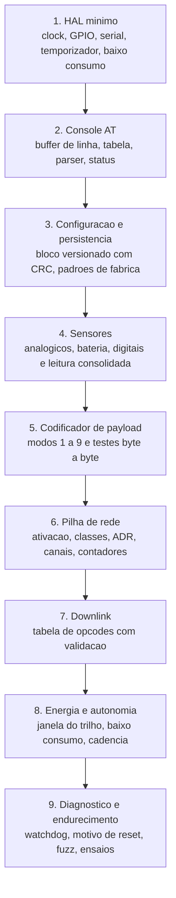

Cada etapa só deve ser considerada concluída quando o critério de aceitação correspondente (§19) passar.
As etapas 1 a 5 são verificáveis **sem rede**; as etapas 6 a 9 exigem servidor de rede ou gateway de teste.

---

## 19. Critérios de aceitação

| # | Critério | Verificação |
|---|---|---|
| CA-01 | A identificação do dispositivo e da região é impressa na inicialização, no formato de linha do console | Leitura do console |
| CA-02 | A ajuda geral lista os 61 comandos e cada comando responde às formas que suporta | Varredura automatizada da tabela |
| CA-03 | Todo parâmetro fora de faixa retorna o status de erro específico **sem** reiniciar o dispositivo | Injeção de valores-limite |
| CA-04 | A restauração de padrões de fábrica preserva as chaves | Comparação de chaves antes/depois |
| CA-05 | Cada modo de trabalho produz payload idêntico ao layout especificado, byte a byte | *Fixtures* por modo |
| CA-06 | Temperatura negativa é decodificada corretamente pelo descodificador de referência | *Fixture* com valor negativo |
| CA-07 | Nenhum payload acima do limite do data rate é transmitido em silêncio | Teste com modo 3 e modo 9 em data rate baixo |
| CA-08 | Downlink truncado, com opcode desconhecido ou argumento fora de faixa não altera configuração nem trava | Fuzzing do dispatcher |
| CA-09 | Downlink válido é aplicado, persistido e confirmado | Teste com servidor de rede |
| CA-10 | Contadores sobrevivem a reinício e continuam monotonicamente crescentes | Reinício entre contagens |
| CA-11 | Consumo em baixo consumo abaixo do limite definido para o conjunto | Medição instrumentada |
| CA-12 | A janela do trilho de sensores é respeitada e o tempo de estabilização é aplicado | Osciloscópio ou marcação por GPIO |
| CA-13 | Reinício por watchdog recupera a operação normal sem perda de configuração | Injeção de travamento |
| CA-14 | Todo campo sem sensor ativo é transmitido como sentinela documentada | Ausência forçada de cada sensor |
| CA-15 | O modo de trabalho é identificável a partir do payload em todos os modos, inclusive o modo 1 | Inspeção dos *fixtures* |

---

## 20. Decisões em aberto

Herdadas da análise da referência e a fechar **antes** do congelamento da especificação:

| # | Decisão | Impacto | Encaminhamento |
|---|---|---|---|
| A1 | Polaridade efetiva do trilho de sensores | Risco de inversão no hardware novo | Medir em bancada e fixar em um único `#define` |
| A2 | Peso no modo 5 em ordem não canônica na referência | Compatibilidade com decodificadores externos | Corrigir para `i16` big-endian e documentar a divergência |
| A3 | Modo 1 não declara o modo no byte de estado | Decodificador precisa inferir pelo comprimento | Declarar sempre; quebra deliberada e registrada |
| A4 | Bit de presença de sensor I2C tem semântica própria | Risco de leitura errada por terceiros | Documentar explicitamente no guia do descodificador |
| A5 | Posição do campo analógico em modos com poucos campos mudou entre revisões | Divergência entre firmware e manual | Fixar por ensaio com hardware |
| A6 | Modos com payload acima de 11 bytes | Incompatibilidade com data rate mais baixo | Aplicar a regra de admissão da §8 |
| A7 | Relação completa de opcodes do bloco clássico de downlink | Tabela incompleta na análise | Enumerar opcode a opcode e publicar a tabela |
| A8 | Layout interno dos blocos de memória não volátil | Não deve ser reproduzido | Substituir por formato versionado com CRC |
| A9 | Pinagem da célula de carga e do sensor ultrassônico | Depende do projeto elétrico | Definir no projeto e documentar |
| A10 | Porta de aplicação padrão do uplink periódico | Afeta o servidor | Definir valor de fábrica e documentar |
| A11 | Instância e pinos reais do console serial | Define a pinagem do novo hardware | Confirmar em bancada antes de congelar |
| A12 | Endereços de GPIO montados por deslocamento, não como literal | Análise estática subestima o uso | Confirmar por leitura dirigida do código |

---

## 21. Anexos

### 21.1 Tabela completa de comandos AT (61 entradas)

Legenda: **Lê** = aceita `AT+CMD=?`; **Grava** = aceita `AT+CMD=<valor>`; **Executa** = aceita `AT+CMD`.
Todo comando aceita também `AT+CMD?` (ajuda curta).

| # | Comando | Lê | Grava | Executa |
|--:|---|:--:|:--:|:--:|
| 0 | `+DEBUG` | - | - | sim |
| 1 | `Z` | - | - | sim |
| 2 | `+FDR` | - | - | sim |
| 3 | `+DEUI` | sim | sim | - |
| 4 | `+APPEUI` | sim | sim | - |
| 5 | `+APPKEY` | sim | sim | - |
| 6 | `+DADDR` | sim | sim | - |
| 7 | `+NWKSKEY` | sim | sim | - |
| 8 | `+APPSKEY` | sim | sim | - |
| 9 | `+ADR` | sim | sim | - |
| 10 | `+TXP` | sim | sim | - |
| 11 | `+DR` | sim | sim | - |
| 12 | `+DCS` | sim | sim | - |
| 13 | `+PNM` | sim | sim | - |
| 14 | `+RX2FQ` | sim | sim | - |
| 15 | `+RX2DR` | sim | sim | - |
| 16 | `+RX1DL` | sim | sim | - |
| 17 | `+RX2DL` | sim | sim | - |
| 18 | `+JN1DL` | sim | sim | - |
| 19 | `+JN2DL` | sim | sim | - |
| 20 | `+NJM` | sim | sim | - |
| 21 | `+NWKID` | sim | sim | - |
| 22 | `+FCU` | sim | sim | - |
| 23 | `+FCD` | sim | sim | - |
| 24 | `+CLASS` | sim | sim | - |
| 25 | `+JOIN` | - | - | sim |
| 26 | `+NJS` | sim | - | - |
| 27 | `+SENDB` | - | sim | - |
| 28 | `+SEND` | - | sim | - |
| 29 | `+RECVB` | sim | - | sim |
| 30 | `+RECV` | sim | - | sim |
| 31 | `+DWELLT` | sim | sim | - |
| 32 | `+RJTDC` | sim | sim | - |
| 33 | `+RPL` | sim | sim | - |
| 34 | `+VER` | sim | - | - |
| 35 | `+CFM` | sim | sim | - |
| 36 | `+CFS` | sim | - | - |
| 37 | `+SNR` | sim | - | - |
| 38 | `+RSSI` | sim | - | - |
| 39 | `+TDC` | sim | sim | - |
| 40 | `+PORT` | sim | sim | - |
| 41 | `+RX1WTO` | sim | sim | - |
| 42 | `+RX2WTO` | sim | sim | - |
| 43 | `+DECRYPT` | sim | sim | - |
| 44 | `+MOD` | sim | sim | - |
| 45 | `+INTMOD1` | sim | sim | - |
| 46 | `+INTMOD2` | sim | sim | - |
| 47 | `+INTMOD3` | sim | sim | - |
| 48 | `+WEIGRE` | - | - | sim |
| 49 | `+WEIGAP` | sim | sim | - |
| 50 | `+5VT` | sim | sim | - |
| 51 | `+SETCNT` | - | sim | - |
| 52 | `+CHS` | sim | sim | - |
| 53 | `+CHE` | sim | sim | - |
| 54 | `+GETSENSORVALUE` | - | sim | - |
| 55 | `+DDETECT` | sim | sim | - |
| 56 | `+SETMAXNBTRANS` | sim | sim | - |
| 57 | `+DISFCNTCHECK` | sim | sim | - |
| 58 | `+DISMACANS` | sim | sim | - |
| 59 | `+RXDATEST` | - | sim | - |
| 60 | `+CFG` | - | - | sim |

Comandos cujo texto de ajuda **não** foi encontrado na tabela da referência (a documentar no novo
firmware): `+TXP`, `+DCS`, `+RX1DL`, `+RX2DL`, `+JN1DL`, `+JN2DL`, `+RX1WTO`, `+RX2WTO`, `+INTMOD1`,
`+INTMOD2`, `+INTMOD3`.

### 21.2 Faixas de validação a implementar

| Parâmetro | Faixa | Observação |
|---|---|---|
| Modo de trabalho | 1 … 9 | Mensagem de erro explícita fora da faixa |
| Gatilho de interrupção | 0 … 3 | 0 desabilita; efeito após reinício |
| Nível de resposta | 0 … 5 | Mensagem de erro explícita |
| Intervalo de rejunção | 1 … 65535 | Em minutos |
| Sub-banda | 0 … 8 | Só para regiões multibanda; efeito após reinício |
| Data rate | Faixa da região | Só alterável com ADR desligado |
| Janela do trilho de sensores | inteiro, em ms | Valor mínimo de estabilização |
| Cadência de transmissão | ≥ mínimo imposto | Mensagem de erro explícita |
| Comprimento de chave | 16 bytes | Erro de comprimento específico |
| Comprimento de EUI | 8 bytes | Erro de comprimento específico |

### 21.3 Estruturas de referência

```c
/* Amostra consolidada - unica fonte para uplink e console */
typedef struct {
    uint8_t  entrada_digital;   /* +0x00                    */
    float    temp1;             /* +0x04  C                 */
    float    temp2;             /* +0x08  C                 */
    float    temp3;             /* +0x0C  C                 */
    float    adc1;              /* +0x10  mV                */
    float    adc2;              /* +0x14  mV                */
    float    adc3;              /* +0x18  mV                */
    float    i2c_temp;          /* +0x1C  C                 */
    float    i2c_hum;           /* +0x20  %RH ou lux        */
    uint16_t dist_i2c;          /* +0x24  mm                */
    uint16_t dist_uart;         /* +0x26  cm                */
    uint16_t dist_strength;     /* +0x28                    */
    uint32_t peso;              /* +0x2C  g                 */
    uint8_t  flag_entrada2;     /* +0x30                    */
} sens_t;                       /* 0x34 bytes               */

/* Descritor de transmissao entregue a pilha de rede */
typedef struct {
    uint8_t *appdata;           /* buffer do payload        */
    uint8_t  len;               /* comprimento              */
    uint8_t  tipo_evento;       /* MAC/sessao ou aplicacao  */
    uint8_t  porta;             /* porta de aplicacao       */
} tx_desc_t;

/* Entrada da tabela de comandos AT */
typedef struct {
    const char *nome;
    uint32_t    len;
    void      (*get)(void);
    void      (*set)(void);
    void      (*run)(void);
    const char *help;
} at_entry_t;

/* Estado do console */
typedef struct {
    uint8_t  flag_novo_caractere;
    uint8_t  reservado[3];
    uint32_t idx;
    char     linha[0x7F];
} console_t;
```

### 21.4 Contratos de compatibilidade a preservar

| Contrato | Definição |
|---|---|
| Bateria | Primeiros 2 bytes, em mV, em todo uplink |
| Temperatura | Décimos de °C, inteiro com sinal; negativo representado em complemento de dois |
| Umidade | Décimos de %RH |
| Analógico | mV, inteiro |
| Byte de estado | Bit 7 = entrada de interrupção 1; bit 1 = entrada digital; bit 0 = presença de sensor I2C; bits 2‑6 = índice do modo (`modo - 1`) |
| Contador | 32 bits big-endian, acumulado monotonicamente crescente |
| Campo inválido | Valor sentinela documentado, nunca omissão |
| Ordenação | Big-endian em todos os campos multi-byte |

### 21.5 Glossário

| Termo | Significado |
|---|---|
| ADR | Adaptação automática de data rate |
| Amostra | Conjunto de grandezas adquiridas em um ciclo |
| Cadência | Intervalo entre uplinks periódicos |
| Console | Interface serial local de configuração e diagnóstico |
| Contador de evento | Acumulado de pulsos em uma entrada de interrupção |
| Data rate | Combinação de fator de espalhamento e largura de banda |
| Downlink | Mensagem do servidor para o dispositivo |
| Dwell time | Tempo máximo de ocupação de canal, exigido em algumas regiões |
| Janela de recepção | Intervalo em que o dispositivo escuta a resposta do servidor |
| Modo de trabalho | Configuração que seleciona as grandezas adquiridas e o layout do payload |
| Nó sensor | O dispositivo especificado neste documento |
| Sentinela | Valor reservado que indica campo sem leitura válida |
| Sub-banda | Agrupamento de canais usado em regiões com muitos canais |
| Uplink | Mensagem do dispositivo para o servidor |
| Trilho comutado | Alimentação ligada apenas durante a janela de amostragem |

---

*Memorial derivado por engenharia reversa do firmware da plataforma de referência. Cada requisito traz a
evidência de origem no documento de análise; as decisões marcadas na §20 devem ser fechadas em bancada
antes do congelamento da especificação.*
