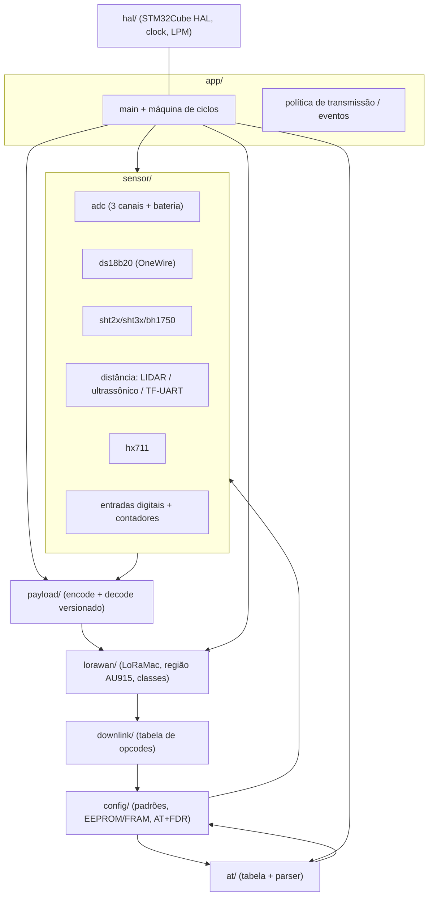

# Engenharia reversa do firmware — LSN50 / LoRa ST, imagem AU915 v1.8.1

Documento de referência obtido por **análise estática do binário** (`FIRMWARE/LSN50_AU915_v1.8.1.hex`),
com o objetivo de servir de **base para uma recodificação completa do firmware** por um agente de IA.

Complementa (não substitui):

| Documento | Papel |
|---|---|
| `docs/memorial.txt` | Memorial da plataforma de referência (hardware, AT, payloads, LoRaWAN) — base documental |
| `docs/memorial-newdevice.md` | Especificação funcional do **novo** dispositivo (generalista): conceito de operação, protocolo de aplicação, requisitos funcionais e não funcionais |
| **este documento** | **O que a imagem v1.8.1 realmente faz** — endereços, estruturas, formatos, algoritmos |

Convenção de confiança usada em todo o texto:

- **[V]** verificado por leitura direta do código desmontado (endereço citado);
- **[I]** inferido por padrão de código/constante, coerente com os manuais;
- **[A]** a confirmar (ponto aberto, listado em §14.5).

---

## 0. Sumário executivo (o que muda em relação ao manual v1.7.4)

O binário é a imagem **v1.8.1** (mais nova que os documentos disponíveis em `datasheet/`), banda **AU915**.
As diferenças materiais confirmadas no binário são:

1. **Modo de trabalho vai de 1 a 9** (o manual v1.7.4 documenta 1 a 6). O `switch` do montador de payload
   tem 9 braços (`0x0800E23C`…`0x0800E7BE`) e o handler de `AT+MOD` valida a faixa com a mensagem
   `"Mode of range is 1 to 9"` (string em `0x08010CA4`). **[V]**
2. **Três entradas de interrupção** em vez de uma: `+INTMOD1` (PB14), `+INTMOD2` (PB15), `+INTMOD3` (PA4),
   com contadores de evento independentes (`PB14_count1`, `PB15_count2`, strings em `0x08001F40`/`0x08001F7C`). **[V]**
3. **Dois contadores de 32 bits** (`[0x20000094+0x40]` e `+0x44`), enviados no MOD9 (17 bytes). **[V]**
4. **Atalho `AT+GETSENSORVALUE`** (lê todos os sensores e imprime em texto, sem transmitir). **[V]**
5. **Comandos novos**: `+DECRYPT`, `+DISMACANS`, `+DISFCNTCHECK`, `+SETMAXNBTRANS`, `+RPL`, `+RJTDC`,
   `+RXDATEST`, `+DDETECT`, `+SETCNT`, `+DWELLT`, `+RX1WTO`, `+RX2WTO`, `+DEBUG`. **[V]**
6. **Downlink estendido** com opcodes `0x20`…`0x33` além da faixa clássica `0x01`…`0x1F`. **[V]**
7. O payload **não** carrega o modo de trabalho em bits 2‑6 do byte 7 como o memorial descreve — nesta
   imagem o byte 7 é `(PB14<<7) | (entrada_digital<<1) | (sensor_I2C_presente)`, **sem** os bits de modo.
   O modo está implícito no comprimento e na posição dos campos. Ver §8.2. **[V]**

---

## 1. Insumos, método e reprodutibilidade

**Insumo.** `FIRMWARE/LSN50_AU915_v1.8.1.hex` — 250.313 bytes, 5.561 registros de dados + 1 registro de
fim + 1 *start linear address*; **todos os checksums válidos**; imagem **contígua**, sem lacunas.

**Método (cadeia reprodutível):**

1. Intel HEX → binário contíguo em `0x08000000..0x08015B8F` (88.976 bytes) — `tools/hexparse.py`.
2. Desmontagem linear ARM **Thumb / Cortex‑M0+** com Capstone 5 (`tools/dsm.py`), tolerante a bytes inválidos
   (o *sweep* não para em dados), com anotação automática dos *literal pools* (valor + string).
3. Extração de strings com endereço (`an.py strings`), agrupadas por faixa para delimitar módulos.
4. Grafo de chamadas por alvos de `BL/BLX` + heurística de início de função (prólogo logo após
   `bx lr` / `pop {..,pc}` / `b`) → **604 funções**, cobertura de 88.608 bytes — `tools/analyze.py`.
5. Perfil por função: chamadores, chamados, strings referenciadas, globais de RAM, registradores de
   periférico referenciados — `tools/show.py`, saída em `re/functions-map.csv`.
6. Leitura manual dirigida: `main`, laço, parser AT, montador de payload, dispatcher de downlink,
   drivers de sensor, GPIO/trilhos, EEPROM.
7. Extração da tabela de comandos AT e geração de CSV — `tools/attable.py`, `tools/mkcsv.py`.

**Ferramentas:** Python 3.12 + `capstone==5.0.7` (venv). Não há toolchain ARM instalada; a desmontagem foi
feita 100% via Capstone. Os scripts estão em `docs/re/tools/` e o binário derivado é reproduzível com:

```
python3 tools/hexparse.py FIRMWARE/LSN50_AU915_v1.8.1.hex lsn50.bin
python3 tools/analyze.py            # gera funcs.json / funcs.txt
python3 tools/mkcsv.py              # gera docs/re/at-commands.csv
```

---

## 2. Identidade e formato da imagem

### 2.1 Banner e versões (strings da imagem) — **[V]**

| Endereço | String |
|---|---|
| `0x0800828E` | `\n\rLSN50 Device\n\r` |
| `0x080082A0` | `Image Version: v1.8.1\n\r` |
| `0x080082B4` | `LoRaWan Stack: DR-LWS-007\n\r` |
| `0x080082D4` | `Frequency Band: ` + `AU915` (`0x08013058`) |
| `0x08013498` | `v1.8.1` (resposta do `AT+VER=?`) |
| `0x080157C6` | `ERROR:Run AT+FDR first` |
| `0x08011A60`–`0x08011A92` | bloco de aviso `Please set the parameters or reset Device to apply change\n\r` |
| `0x08012293` | ` DevEui= %02X %02X %02X %02X %02X %02X %02X %02X\n` |

A banda é **compilada** na imagem (não há comando AT para trocar), coerente com o memorial §12.2.

### 2.2 Tabela de vetores — **[V]**

`SP` inicial = `0x20001DC0`. Tabela em `0x08000000`, 48 entradas (16 de sistema + 32 de IRQ).

| Vetor | Endereço | Observação |
|---|---|---|
| Reset (1) | `0x080000D4` | carrega `0x0800EC95` (startup Keil) e salta |
| NMI (2) | `0x08009A54` | |
| HardFault (3) | `0x08007ABC` | |
| SVCall (11) | `0x0800C912` | |
| PendSV (14) | `0x0800A96C` | |
| SysTick (15) | `0x0800EC00` | base de tempo (tick) |
| IRQ5 / IRQ6 / IRQ7 | `0x08003828` / `0x08003838` / `0x08003848` | **EXTI0_1 / EXTI2_3 / EXTI4_15** — as 3 entradas de interrupção |
| IRQ11 | `0x08002A38` | (DMA/ADC) wrapper fino |
| IRQ16 | `0x0800ECF0` | |
| IRQ20 | `0x0800ECE8` | |
| IRQ27 | `0x0800F6EC` | ISR do UART de console — handle `0x20000A0C` (wrapper `0x080134A0` → `0x08006C88`); o código acessa o bloco de registradores **USART1** (`0x40013800`) — ver ressalva em §9.1 |
| IRQ29 | `0x0800B1FC` | ISR do UART do sensor de distância — handle `0x2000099C` (bloco **LPUART1**, `0x40004800`) |
| demais | `0x080000E6` | `Default_Handler` — `b .` (loop infinito) |

### 2.3 Mapa de memória

| Região | Faixa | Uso |
|---|---|---|
| Flash | `0x08000000`–`0x08015B8F` | código + constantes (**88.976 B**, 46 % dos 192 KB) |
| Tabela de *scatter-load* | `0x08015AE0`–`0x08015B04` | 2 regiões `{load, exec, size, fn}` (runtime Keil) |
| **EEPROM de dados** | `0x08080000`+ | parâmetros persistentes (ver §11) |
| RAM | `0x20000000`–`0x20005000` | 20 KB |
| RAM – dados RW | `0x20000000`–`0x2000028B` | 652 bytes inicializados (copiados da flash) |
| RAM – ZI/BSS | `0x2000028C`–`0x20001DBF` | 6.964 bytes zerados |
| Pilha | `0x20001DC0`–`0x20005000` | ~12,8 KB |

### 2.4 Toolchain

Compilador **Keil ARM (MDK)** por três indícios: (a) tabela de *scatter-load* com descritor de
descompressão no fim da imagem; (b) *literal pools* intercalados no estilo ARMCC; (c) o memorial §14.1
declara o projeto `MDK-ARM/Lora.uvprojx`. O núcleo é **Cortex‑M0+ (Thumb only)** — todas as instruções
têm 2 ou 4 bytes, sem ARM nem Thumb‑2 de 32 bits longos.

---

## 3. Mapa de módulos (por faixa de endereço) — **[V]**

| Faixa | Conteúdo |
|---|---|
| `0x080000C0`–`0x08000F00` | runtime de compilador: divisão/multiplicação (`__aeabi_*`), `f2iz`, `fmul`, memcpy/memset/strncmp, `printf` (`0x0800F06C`) |
| `0x08000F00`–`0x08003000` | **drivers de sensor**: ADC, I2C (`0x08001638`/`0x0800231C`/`0x08002360`), OneWire/DS18B20 (`0x08002A60`), UART, GPIO, delay |
| `0x08003000`–`0x08003D00` | **EEPROM/parametros** (`0x080030B8`, `0x08003388`, `0x08003AB8`), LoRaMac init (`0x080036AC`, `0x08003714`, `0x08003774`, `0x080037C4`), GPIO init por pino |
| `0x08004000`–`0x08007000` | **HAL STM32Cube** (GPIO `0x08004A20`/`0x08004BA4`/`0x08004BAE`, I2C `0x08004C18`, ADC `0x08007224`, DMA/UART `0x08006E38`, timers base) |
| `0x08006C00`–`0x08007500` | HAL de UART/DMA e wrapper de ADC |
| `0x08007500`–`0x08008300` | init de periféricos no boot + **pilha LoRaWAN (LoRaMac‑node)**: MAC, regiões, canais |
| `0x080083D0`–`0x0800F000` | **LoRaMac** (`0x08009AF0` máquina da pilha ~0xC3C B), callbacks, ADR, cripto/AES, gerência de sessão |
| `0x0800F000`–`0x08012000` | **camada de aplicação**: `main` (`0x0801245C`), montador de payload (`0x0800E1D8`), laço, banners, contadores, atalho de sensor (`0x08001B10`) |
| `0x08012000`–`0x08013700` | **AT/serviços**: parser (`0x08012B30`), tabela (dados, `0x08013E34`), acesso a config, trilho 5 V, contadores, console |
| `0x08013700`–`0x08013E00` | HAL de UART/console (`0x08013940` USART1, `0x08013A90` LPUART1), GPIO de sensor |
| `0x08013E34`–`0x080143EC` | **tabela de comandos AT** (61 × 24 B) |
| `0x080143F0`–`0x080148E0` | tabelas de região/canal (AU915), máscaras, *strings* auxiliares |
| `0x080148E0`–`0x080158C0` | *help* de todos os comandos AT |
| `0x080158C0`–`0x08015AE0` | nomes de comando sem o prefixo `AT` (`+DEUI`, `+CFG`, …) |

---

## 4. Boot e inicialização

### 4.1 Sequência de `main` (`0x0801245C`) — **[V]**

```
main():
    HAL_Init()                           -> 0x080052CC
    SystemClock_Config()                 -> 0x0800EC08
    gpio/clock init                      -> 0x080029D8
    adc_init()                           -> 0x08007514
    uart/console init                    -> 0x0800242C  (zera flag AT em 0x2000013C, inicia RX)
    reset_cause_and_init()               -> 0x08012218  (RCC_CSR, IWDG)
    copy defaults over timer area        -> memcpy(0x20000864, 0x08009B79, ...)
    TimerInit(0x20000864, ...)           -> 0x0800EE84
    TimerSetValue(0x20000864, 0x4650)    -> 0x0800EF54   ; 0x4650 = 18000 (tick base)
    TimerStart(0x20000864)               -> 0x0800EF78
    if (*(uint32_t*)0x08080000..0x0808000C == 0)   ; EEPROM virgem?
         factory_init(); delay(200)      -> 0x08003AC8, 0x080036AC, 0x08004852(0xC8)
    post_boot_config()                   -> 0x08012AC4  (carrega config, inicia pilha, imprime banner)
    LoRaMacSetMaxNbTrans(1)              -> 0x08008BCC
    LoRaMacInitialization()              -> 0x080081B4  (banner "LSN50 Device" / "Image Version")
    ...; loop infinito (ver §5)
```

A leitura de `0x08080000` (EEPROM mapeada) para decidir "primeiro boot" é **[V]** (`0x0801248C`–`0x080124B2`).

### 4.2 Banner

Impresso por `0x080081B4`: `\n\rLSN50 Device\n\r`, `Image Version: v1.8.1\n\r`,
`LoRaWan Stack: DR-LWS-007\n\r`, `Frequency Band: <AU915>`, seguido do estado da rede
(`JOINED\r\n`) e do aviso *"Please set the parameters or reset Device to apply change"*.

---

## 5. Loop principal (pseudo‑código reconstruído) — **[V]**

Base do laço: `0x080124D6`. Estado (`r4 = 0x20000094`, `r6 = 0x200000B4`, `r7 = 0x20000218`).

```
for (;;) {
    app_tick();                                  // 0x08002444  -> parse da linha AT
    if (st[0x0F]) { st[0x0F]=0; st[0x10]=1;     // pulso programado
                    gpio(...); timer.set(0x28, 1000); ... }

    if (st[0x12] && !busy) { st[0x12]=0; apply_class(); }        // 0x08008338
    if (st[0x16] && !busy) { st[0x16]=0; st[0x17]=1;              // config pendente
                             timer_restart(3 timers); apply(); }

    if (st[0x0E]) { interrupt_report(); }        // 0x080130FC  COUNT1/COUNT2
        if (evt >= 5) { evt=0; delay(100); }
        else switch (st[0x0B]) { case 1: delay(500); post_event(0x11,len=1,t=4,0); break;
                                 case 2: pb14_read(); post_event(0x11,len=1,t=4,0); break; }

    if (st[0x19] && !busy) { tx_uplink(); st[0x19]=0; }          // 0x0800E1D8 gera+envia

    if (st[0x07]) {                               // leitura das 3 entradas digitais
        pb14 = gpio_read(GPIOB, PIN_14); st[1] = pb14;
        pb15 = gpio_read(GPIOB, PIN_15); st[2] = pb15;
        pa4  = gpio_read(GPIOA, PIN_4 ); st[3] = pa4;
        if (pb14 != st[1_old] || pb15 != ... || pa4 != ...) st[0x19] = 1;  // dispara uplink
        st[0x07] = 0;
    }

    if (st[0x1B] && !busy) { st[0x1B]=0;                        // payload pronto: copia p/ MAC
        len = st[0]; for (i<len) mac.appdata[i] = st[0x08+i];
        mac.len = len; mac.evt = 0x0C; mac.port = GetPort();
        LoRaMacEvent(mac);                                      // 0x08008A38
    }
    if (st[0x1C] && !busy) { st[0x1C]=0; tx_flow_1(); }         // 0x0800EAA8
    if (st[0x13]) { st[0x13]=0; st[0x17]=1; ... timers ... }    // 0x080127D8
    if (st[0x0C]) { st[0x0C]=0; rx_flow(); }                    // 0x080080EC
    __disable_irq(); tick_sleep_lpm(); __enable_irq();          // 0x08008ACC (STOP mode)
}
```

Pontos de arquitetura que o novo firmware precisa reproduzir:

1. **Nada bloqueia**: cada etapa é um flag verificado no laço; o laço entra em baixo consumo
   (`0x08008ACC`, com `cpsid i`/`cpsie i` em volta).
2. **Um único caminho de envio**: montar payload → `set_appdata(buf,len)` → evento de camada MAC `0x0C`.
3. **Detecção de borda por polling** das 3 entradas `PB14/PB15/PA4` a cada volta do laço (`st[0x07]`
   força uma nova leitura), com disparo de uplink quando qualquer uma muda. As IRQs EXTI existem
   (vetores 5/6/7) e alimentam os contadores por hardware.
4. **Duas fontes de uplink**: por timer (`AT+TDC`) e por evento (mudança de entrada digital /
   interrupção / comando AT/GETSENSORVALUE).

---

## 6. Estado global em RAM (reconstruído) — **[V]**

### 6.1 Estrutura da aplicação — base `0x20000094`

| Offset | Absoluto | Tipo | Significado (evidência) |
|---|---|---|---|
| `+0x00` | `0x20000094` | u8 | **comprimento do payload** a enviar (`ldrb r1,[r4]` antes do `memcpy` p/ MAC) |
| `+0x01..+0x03` | `0x20000095`–`97` | u8×3 | último estado lido de **PB14, PB15, PA4** |
| `+0x07` | `0x2000009B` | u8 | flag "informar mudança de entrada no próximo uplink" |
| `+0x08` | `0x2000009C` | u8[] | **buffer de payload** (origem da cópia para o MAC) |
| `+0x0B` | `0x2000009F` | u8 | estado da máquina de pós-processamento do laço |
| `+0x0C` | `0x200000A0` | u8 | flag "processar fluxo de recepção" (`0x080080EC`) |
| `+0x0E` | `0x200000A2` | u8 | flag "relatar contadores" (`0x080130FC`) |
| `+0x0F` | `0x200000A3` | u8 | pulso programado (LED/trilho) |
| `+0x11` | `0x200000A5` | u8 | "transmissão em andamento" (setado por `0x0800845C`) |
| `+0x12` | `0x200000A6` | u8 | pedido de troca de classe |
| `+0x13` | `0x200000A7` | u8 | pedido de reenvio/retry |
| `+0x16` | `0x200000AA` | u8 | **configuração de downlink recebida → reaplicar** |
| `+0x17` | `0x200000AB` | u8 | "config alterada, precisa reenviar" |
| `+0x19` | `0x200000AD` | u8 | **dispara uplink** |
| `+0x1B` | `0x200000AF` | u8 | payload pronto para a pilha |
| `+0x1C` | `0x200000B0` | u8 | fluxo de tx auxiliar |
| `+0x1D` | `0x200000B1` | u8 | parâmetro de rádio setado por downlink (≤5) — TXP/DR **[A]** |
| `+0x2E` | `0x200000C2` | u16 | **tensão da bateria (mV)** |
| `+0x34` | `0x200000C8` | u16 | tipo/presença do sensor I2C (bit0 = presente) |
| `+0x38` | `0x200000CC` | u16 | flag de mudança PB15 |
| `+0x3C` | `0x200000D0` | u16 | flag de mudança PA4 |
| `+0x40` | `0x200000D4` | u32 | **contador de eventos 1** (PB14) |
| `+0x44` | `0x200000D8` | u32 | **contador de eventos 2** (PB15) |
| `+0x58` | `0x200000EC` | — | descritor de transmissão: `[0]=ptr buffer`, `[+4]=len`, `[+5]=tipo`, `[+7]=porta` |

### 6.2 Configuração — base `0x200001AC` (persistida na EEPROM)

Acesso por funções pequenas e dedicadas (uma por campo), o que torna o mapa legível:

| Função | Offset | Campo |
|---|---|---|
| `0x08012300` / `0x0801230C` | `+0x0B` (`0x200001B7`) | **modo de trabalho (MOD 1..9)**, `ldrsb` (com sinal) |
| `0x080122C8` / `0x080122D0` | `+0x0C` | parâmetro 1 (persistido na EEPROM) |
| `0x080122E4` / `0x080122EC` | `+0x14` | parâmetro 2 |
| `0x08012318` / `0x08012320` | `+0x14`+? | parâmetro 3 |
| `0x08012388` / `0x08012390` | `+0x16` (`0x200001C2`) | parâmetro 4 |
| `0x080123E0` / `0x080123E8` | `+0x1C` | parâmetro 5 |
| `0x08012414` | `+0x14`? | **porta de aplicação (FPORT)** — usada no envio |
| `0x08012420`, `0x0801242C`, `0x08012438`, `0x08012444` | vários | accessors usados pelo AT (get/set) |

> Os offsets `+0x0B..+0x1C` acima são **verificados** (`ldrb/ldrsb r0,[r1,#imm]` com `r1=0x200001AC`),
> mas o *nome* de cada parâmetro veio do encadeamento com o handler AT que chama o accessor (§9).

### 6.3 Outros globais

| Endereço | Uso |
|---|---|
| `0x20000124` | estrutura de contadores/estado de MAC usada nos *traces* |
| `0x2000013C` | **estado do console AT**: `[0]=flag de novo caractere`, `[+4]=índice` |
| `0x20000144` | buffer/máscara de parâmetros de região |
| `0x2000014B` | **modo de trabalho corrente** usado pelo montador de payload (valores 1..9) |
| `0x2000014C`–`0x2000014E` | flags que forçam `st[7]=1` (relatório de entrada digital) |
| `0x200001D8` | estado da pilha LoRaWAN (frame counters, canais, ADR, sessão) |
| `0x20000218` | word de estado/erro consultada a cada volta do laço (bits 0 e 4 = "ocupado") |
| `0x20000864`+ | área de *timers* do `Timer` do LoRaMac‑node (`+0x14`, `+0x28`, `+0x3C`, `+0x50`) |
| `0x20000BBB` | **buffer da linha de comando AT** (máx. 0x7F) |
| `0x20000A0C` / `0x2000099C` | handles HAL de UART: console (IRQ27) e sensor de distância (IRQ29) — instâncias a confirmar (§9.1) |

---

## 7. Camada de sensores

### 7.1 Detecção no boot — `0x0800179C` **[V]**

Imprime o sensor detectado e ajusta o modo:

```
Use Sensor is STH2x / STH3x            (I2C, 0x080019D0 / 0x080019EC)
Use Sensor is BH1750                   (I2C, 0x08001A04)
No I2C device detected                 (0x08001A20)
Use Sensor is LIDAR_Lite_v3HP          (I2C, 0x08001A44)
Use Sensor is ultrasonic distance measurement  (0x08001A68)
No distance measurement device detected        (0x08001A9C)
Use Sensor is TF-series sensor         (UART, 0x08001AC8)
Use Sensor is HX711                    (0x08001AEC)
```

Chama `0x08012F3C` (habilita trilho **+5 V** via PB5) antes de sondar os sensores, e as leituras I2C
`0x0800231C`/`0x08002360` (via `0x08004C18` = transação com registrador).

### 7.2 Estrutura de aquisição (buffer de 0x34 bytes na pilha do montador de payload)

Reconstruída a partir dos offsets lidos em `0x0800E1D8` (montagem por MOD): **[V]**

| Offset | Tipo | Grandeza |
|---|---|---|
| `+0x00` | u8 | entrada digital (PA12) |
| `+0x04` | f32 | temperatura DS18B20 #1 (PB3) |
| `+0x08` | f32 | temperatura DS18B20 #2 (PA9) |
| `+0x0C` | f32 | temperatura DS18B20 #3 (PA10) |
| `+0x10` | f32 | ADC1 (PA0) |
| `+0x14` | f32 | ADC2 (PA1) |
| `+0x18` | f32 | ADC3 (PA4) |
| `+0x1C` | f32 | temperatura I2C (SHT2x/SHT3x) |
| `+0x20` | f32 | umidade I2C (ou luminância BH1750) |
| `+0x24` | u16 | distância (LIDAR‑Lite) |
| `+0x26` | u16 | distância (ultrassônico / TF) |
| `+0x28` | u16 | intensidade de sinal (TF) |
| `+0x2C` | u32 | peso (HX711) |
| `+0x30` | u8 | flag de atividade PB15 |

Todas as temperaturas são `float` em **°C**; o montador multiplica por `10.0f` (`0x41200000`) e converte
para inteiro (`0x08000516` = `fmul`, `0x080009C4` = `f2iz`) obtendo **décimos de °C** — exatamente a
escala documentada no memorial §8.8(b). **[V]**

### 7.3 Drivers

| Elemento | Endereço | Notas |
|---|---|---|
| DS18B20 (OneWire bit‑bang) | `0x08002A60` + primitivas `0x08002B50`, `0x08002B6C`, `0x08002BE0`, `0x08002C54` | sem periférico dedicado; GPIO + atrasos |
| Leitura I2C | `0x0800231C`, `0x08002360` (via `0x08004C18`) | SHT2x/SHT3x/BH1750 |
| ADC (3 canais + bateria) | `0x08007224`, `0x08007280`, init `0x08007514`, escala `0x08007400` | referência interna 3,3 V |
| UART do sensor (MOD2) | LPUART1 (`0x40004800`), ISR `0x0800B1FC` | handle `0x2000099C` — instância a confirmar (§9.1) |
| Entradas digitais | `HAL_GPIO_ReadPin` = `0x08004BA4` em `GPIOB` | PB14 (`0x4000`), PB15 (`0x8000`), PA4 (`0x10`) |
| HX711 | ver `0x08007400`/`0x0800747C` (chamados por `0x08001B10`) | **[A]** pinagem exata |
| Leitura consolidada + impressão | `0x08001B10` (909 instruções, `str:` `Bat:%.3f V`, `DS18B20_temp1:%.1f`, `SHT2x_temp:%.1f,SHT2x_hum:%.1f`, `ADC_PA0:%.3f V`, `ULT_distance:%.1f cm`, `TF_distance:%d cm,TF_strength:%d`, `HX711_Weight:%d g`, `PB14_count1:%u`, `PB15_count2:%u`) | é a **única** implementação de aquisição: serve ao uplink **e** ao `AT+GETSENSORVALUE` |

### 7.4 Trilho +5 V e LED — **[V]**

| Função | Comportamento |
|---|---|
| `0x08012F3C` | habilita clock do GPIOB (`RCC_IOPENR |= 2`), configura **PB5** como saída (mode `0x11` = open‑drain, pull‑up, speed high) e chama `HAL_GPIO_WritePin(GPIOB, 0x20, 1)` → **PB5 = 1**; usada **antes** da amostragem |
| `0x08012F00` | mesma configuração, sem acionar o pino (usada na detecção inicial de sensores) |
| `0x080000F0` / `0x08004852` | atrasos usados em conjunto com a chave de trilho |

> ⚠️ **Divergência com o memorial**: o manual §5.3 declara "*NÍVEL BAIXO = HABILITA*" o +5 V.
> No código, a função usada **antes da amostragem** deixa PB5 em **nível alto** (`0x08012F72`–`0x08012F78`)
> e o atraso de habilitação (`AT+5VT`) é aplicado em seguida. Marcar **[A]**: confirmar com medição no
> hardware ou lendo o esquemático original; em qualquer caso, **a polaridade efetiva deve ser fixada por
> um único `#define` na recodificação**.

### 7.5 Estratégia de energia observada

- O trilho `VDD` permanece ligado; o `+5 V` é chaveado em torno da janela de amostragem
  (`0x08012F3C` + espera configurável por `AT+5VT`, parâmetro lido por `0x08010334`).
- O laço entra em modo de baixo consumo a cada volta: `__disable_irq(); lpm(); __enable_irq()`
  (`0x08008ACC`).
- `AT+TDC` é aplicado a `TimerSetValue(0x20000864+0x14, ms)` no início do laço.

---

## 8. Payload de uplink — MOD 1 a 9 (formato real do binário) — **[V]**

### 8.1 Regras gerais

- Montador: **`0x0800E1D8`** (`tx_uplink`), chamado pelo laço quando `st[0x19] != 0`.
- Ordem: **big‑endian** em todos os campos multi‑byte (`lsrs r0,#8; strb …` = MSB primeiro).
- Porta: **FPORT = 2** por padrão, ou o valor do accessor `0x08012414` (`AT+PORT`) **[A]**.
- Descritor entregue à pilha: `{ptr=0x2000009C, len, tipo=0x0C, porta}` em `0x200000EC` (`0x0800E8B6`–`0x0800E8CC`).
- **Comprimentos confirmados no código**: MOD1/2/4/5/6/7/8 = **11 (0x0B)**, MOD3 = **12 (0x0C)**,
  MOD9 = **17 (0x11)**.
- O campo correspondente a "ADC" é escrito **cru como inteiro** (mV), enquanto temperaturas e umidade
  I2C são multiplicados por 10 (décimos). A bateria é lida como `u16` em mV da struct (`+0x2E`).

### 8.2 Byte 7 ("Digital in & Digital Interrupt") — formato real **[V]**

```
byte[6] = (estado_PB14 << 7)                    ; bit 7  – interrupcao/porta
        | (entrada_digital << 1)                ; bit 1  – PA12 lida na amostragem
        | (sensor_I2C_presente & 1)             ; bit 0  – bit0 do tipo do sensor I2C
        | MASCARA_DE_MODO                       ; OR com o modo (ver tabela)
```

`MASCARA_DE_MODO` por MOD (evidência direta no código):

| MOD | OR aplicado | índice de modo (`>=2`) | Endereço da evidência |
|---|---|---|---|
| 1 | nenhum | 0 | `0x0800E23C` |
| 2 | `0x04` | 1 | `0x0800E37E` |
| 3 | `0x08` | 2 | `0x0800E420` |
| 4 | `0x0C` | 3 | `0x0800E514` |
| 5 | `0x10` | 4 | `0x0800E5CA` |
| 6 | `0x14` | 5 | `0x0800E656` |
| 7 | `0x18` | 6 | `0x0800E704` |
| 8 | `0x1C` | 7 | `0x0800E792` |
| 9 | `0x20` | 8 | `0x0800E834` |

Ou seja: **o modo continua nos bits 2‑6**, mas apenas a partir do MOD2 (`(byte7>>2)&0x1F` dá 0..8) — o que
preserva os decodificadores existentes descritos no memorial §8.9, **exceto** que MOD1 não grava nada
nesses bits (índice 0 = MOD1, coerente).

### 8.3 Layouts por MOD

#### MOD1 — I2C (11 bytes) — `0x0800E23C`

| Bytes | Campo | Fonte |
|---|---|---|
| 0‑1 | BAT (mV) | `st[+0x2E]` |
| 2‑3 | Temperatura DS18B20 #1 (décimos °C) | `[sp+4] ×10` |
| 4‑5 | ADC (mV) | `[sp+0x10]` |
| 6 | byte 7 (§8.2) | PB14 / PA12 / sensor I2C |
| 7‑8 | Temperatura I2C (décimos °C) | `[sp+0x1C] ×10` |
| 9‑10 | Umidade I2C (décimos %RH) | `[sp+0x20] ×10` |

#### MOD2 — distância (11 bytes) — `0x0800E312`

| Bytes | Campo |
|---|---|
| 0‑1 | BAT |
| 2‑3 | Temperatura #1 ×10 |
| 4‑5 | ADC |
| 6 | byte 7 \| `0x04` |
| 7‑8 | Distância (`[sp+0x26]`, u16) |
| 9‑10 | Intensidade (`[sp+0x28]`) ou **`0xFF 0xFF`** quando `≠ 3` (código `0x0800E39C`–`0x0800E3A4`) |

#### MOD3 — 3 ADC + I2C (12 bytes) — `0x0800E3B6`

| Bytes | Campo |
|---|---|
| 0‑1 | ADC1 (PA0) |
| 2‑3 | ADC2 (PA1) |
| 4‑5 | ADC3 (PA4) |
| 6 | byte 7 \| `0x08` |
| 7‑8 | Temperatura I2C ×10 |
| 9‑10 | Umidade I2C ×10 |
| 11 | **BAT (1 byte, LSB)** — `movs r6,#0xC` em `0x0800E4A2` |

Confere com o memorial §8.4 (incluindo o alerta de 12 bytes > 11 bytes do DR0 em AU915/US915).

#### MOD4 — 3 × DS18B20 (11 bytes) — `0x0800E4A8`

| Bytes | Campo |
|---|---|
| 0‑1 | BAT |
| 2‑3 | Temperatura #1 ×10 |
| 4‑5 | ADC |
| 6 | byte 7 \| `0x0C` |
| 7‑8 | Temperatura #2 ×10 |
| 9‑10 | Temperatura #3 ×10 |

#### MOD5 — peso / HX711 (11 bytes) — `0x0800E55E`

| Bytes | Campo | Evidência |
|---|---|---|
| 0‑1 | BAT | `0x0800E560` |
| 2‑3 | Temperatura #1 ×10 | `0x0800E574` |
| 4‑5 | ADC | `0x0800E592` |
| 6 | byte 7 \| `0x10` | `0x0800E5CA` |
| 7 | `0x00` | `0x0800E5F6` |
| 8 | `peso & 0xFF` | `0x0800E5FC` |
| 9 | `peso >> 24` | `0x0800E600` |
| 10 | `(peso >> 16) & 0xFF` | `0x0800E606` → `0x0800E3A4` |

> ⚠️ **Anomalia real do binário** (bytes brutos confirmados: `31 68 C8 71 30 68 0B 99 01 72 0B 99 09 0E 41 72`
> em `0x0800E5F4`): o peso é emitido como **b0, b3, b2** — **não** é big‑endian canônico e **não** confere
> com o layout do memorial §8.6 (que prevê 2 bytes em 8‑9). Tratar como *bug* de firmware de referência:
> na recodificação, fixar `peso` como `int16` big‑endian nos bytes 8‑9 (e documentar a decisão).

#### MOD6 — contagem (11 bytes) — `0x0800E60A`

| Bytes | Campo |
|---|---|
| 0‑1 | BAT |
| 2‑3 | Temperatura #1 ×10 |
| 4‑5 | ADC |
| 6 | `(entrada_digital<<1) \| 0x14` (**sem** bit de PB14) |
| 7‑10 | **Contador de 32 bits big‑endian** (`st[+0x40]`: `>>>24`, `>>>16`, `>>>8`, `&0xFF`) |

O contador é o mesmo acessado por `AT+SETCNT` (`0x08011120`), o que liga o comando ao campo do payload. **[V]**

#### MOD7 — estado das entradas digitais (11 bytes) — `0x0800E678`

| Bytes | Campo |
|---|---|
| 0‑1 | BAT |
| 2‑3 | Temperatura #1 ×10 |
| 4‑5 | ADC |
| 6 | byte 7 \| `0x18` |
| 7 | `(flag_PB15 << 4) \| estado_PB15` |
| 8 | `(flag_PA4 << 4) \| estado_PA4` |
| 9 | `0xFF` |

#### MOD8 — ADCs + BAT/T (11 bytes) — `0x0800E728`

| Bytes | Campo |
|---|---|
| 0‑1 | BAT |
| 2‑3 | Temperatura #1 ×10 |
| 4‑5 | ADC1 (PA0) |
| 6 | byte 7 \| `0x1C` |
| 7‑8 | `[sp+0x14]` (ADC2 / PA1) |
| 9‑10 | `[sp+0x18]` (ADC3 / PA4) |

#### MOD9 — 3 temperaturas + 2 contadores (17 bytes) — `0x0800E7BE`

| Bytes | Campo |
|---|---|
| 0‑1 | BAT |
| 2‑3 | Temperatura #1 ×10 |
| 4‑5 | Temperatura #2 ×10 |
| 6 | byte 7 \| `0x20` |
| 7‑8 | Temperatura #3 ×10 |
| 9‑12 | **Contador 1** (`st[+0x40]`, 32 bits BE) |
| 13‑16 | **Contador 2** (`st[+0x44]`, 32 bits BE) |

**17 bytes** — acima do limite de 11 bytes do DR0 em AU915 (ver §12.3 e R‑01 do memorial).

### 8.4 Tabela resumida

| MOD | Total | Byte 7 (OR) | Sequência |
|---|---|---|---|
| 1 | 11 | — | BAT(2) T1(2) ADC(2) DIG(1) TI2C(2) HI2C(2) |
| 2 | 11 | 0x04 | BAT(2) T1(2) ADC(2) DIG(1) DIST(2) SIG(2) |
| 3 | **12** | 0x08 | ADC1(2) ADC2(2) ADC3(2) DIG(1) TI2C(2) HI2C(2) BAT(1) |
| 4 | 11 | 0x0C | BAT(2) T1(2) ADC(2) DIG(1) T2(2) T3(2) |
| 5 | 11 | 0x10 | BAT(2) T1(2) ADC(2) DIG(1) 0 PESO(…) |
| 6 | 11 | 0x14 | BAT(2) T1(2) ADC(2) DIG(1) CONT(4) |
| 7 | 11 | 0x18 | BAT(2) T1(2) ADC(2) DIG(1) PB15(1) PA4(1) 0xFF(1) |
| 8 | 11 | 0x1C | BAT(2) T1(2) ADC1(2) DIG(1) ADC2(2) ADC3(2) |
| 9 | **17** | 0x20 | BAT(2) T1(2) T2(2) DIG(1) T3(2) CONT1(4) CONT2(4) |

---

## 9. Console AT

### 9.1 Transporte e linha de comando — **[V]**

- Console em **UART** com **handle HAL em `0x20000A0C`**, 9600 8N1, sem *flow control*. Escrita pelo helper de
  console `0x080023A4` → `0x08013940`; impressão formatada pelo `printf` interno `0x0800F06C`.

> **Ressalva de instância [A].** O código do caminho de console acessa o bloco de registradores de
> **USART1** (`0x40013800`, usado em `0x08013944`), e o IRQ27 (`0x0800F6EC`) serve esse mesmo handle.
> O mapa de pinos do memorial §5.3, porém, atribui PA9/PA10 aos DS18B20 #2/#3 e coloca o console em
> PA2/PA3 (que no STM32L072 correspondem a USART2/LPUART1). Além disso o HAL presente na imagem é
> genérico (compara a instância contra USART1, USART2 `0x40004400` e LPUART1 `0x40004800` — `0x0800F422`).
> Como o firmware faz *bit-bang* de OneWire (não usa USART para isso) e o console é o único fluxo de
> texto em 9600 8N1 observado, **confirmar em bancada qual instância e quais pinos** são usados antes
> de congelar a pinagem do novo hardware.
- O ISR de USART1 (`0x0800F6EC` → `0x080134A0`) apenas **sinaliza** a chegada de caractere
  (`flag` em `0x2000013C`).
- A **montagem da linha** acontece no laço principal, em `0x08002444`:

```
char c = rxbuf[idx]                     // rxbuf = 0x20000BBB
if (c == 0x01) { idx = 0; help(8); }                       // Ctrl-A -> ajuda
else if (c == 0x0D || c == 0x0A) { if (!idx) return;
                                   rxbuf[idx] = 0; idx = 0;
                                   AT_parse(rxbuf); }      // 0x08012B30
else if (idx == 0x7F) { idx = 0; help(6); }                // DEL -> ajuda
else { rxbuf[idx++] = c; }                                 // limite 0x7F
```

**Consequência prática:** o comando só é processado ao receber `<CR>`/`<LF>` — reproduz o alerta do
memorial §10.1 sobre terminais que não enviam *Enter*.

### 9.2 Sintaxe e despacho — `0x08012B30` **[V]**

O parser foi reconstruído linha a linha:

```
AT_parse(char* cmd):
    if (cmd[0]!='A' || cmd[1]!='T') err();                 // 0x08012B38
    if (cmd[2] == 0)      { help_all(); return; }           // 0x08012B4A
    if (cmd[2] == '?')    { for (i=0; i<61; i++) printf(tab[i].help); return; }
    p = cmd + 2;
    for (i = 0; i < 61; i++) {                              // 0x08012B72 (cmp r4,#0x3D)
        e = &tab[i];
        if (strncmp(p, e->nome, e->len) == 0) break;         // 0x08012B68 -> 0x08000290
    }
    if (i == 61) { help_all(); err(); return; }
    c = p[e->len];
    if (c == 0)   e->run();                                 // "AT+CMD"
    else if (c == '=') { if (p[e->len+1]=='?') e->get();    // "AT+CMD=?"
                         else e->set(); }                   // "AT+CMD=<valor>"
    else if (c == '?') printf(e->help);                     // "AT+CMD?"
    else err();
```

Estrutura de cada entrada (24 bytes, `0x08013E34` + 24·i):

| Offset | Campo |
|---|---|
| `+0x00` | `const char* nome` (sem o prefixo `AT`, ex.: `"+MOD"`, `"Z"` para o `ATZ`) |
| `+0x04` | `uint32_t` **tamanho do nome** (usado no `strncmp`) |
| `+0x08` | `void (*get)(void)` — `AT+CMD=?` |
| `+0x0C` | `void (*set)(void)` — `AT+CMD=<valor>` |
| `+0x10` | `void (*run)(void)` — `AT+CMD` |
| `+0x14` | `const char* help` |

Convenção de retorno dos handlers: **`0x08011760` = stub neutro** (`movs r0,#1; bx lr`), usado como
"não há handler"; os pares get/set reais ficam tipicamente a 20 bytes de distância um do outro
(ex.: `AT+MOD`: get `0x08010C2C`, set `0x08010C40`).

Status devolvidos (strings em `0x08014E7E`…`0x08014FC2`): `OK`, `AT_ERROR`, `AT_PARAM_ERROR`,
`AT_PARAM_ERROR(Incorrect Length)`, `AT_BUSY_ERROR`, `AT_TEST_PARAM_OVERFLOW`,
`AT_NO_NETWORK_JOINED`, `AT_RX_ERROR`.

### 9.3 Tabela completa — 61 comandos **[V]**

Extraída byte a byte (`0x08013E34`, 61 × 24 B). A lista canônica, com endereços de cada handler, está em
**`docs/re/at-commands.csv`**. Ordem de declaração:

| # | Comando | # | Comando | # | Comando |
|---|---|---|---|---|---|
| 0 | `AT+DEBUG` | 21 | `AT+NWKID` | 42 | `AT+RX2WTO` |
| 1 | `ATZ` | 22 | `AT+FCU` | 43 | `AT+DECRYPT` |
| 2 | `AT+FDR` | 23 | `AT+FCD` | 44 | `AT+MOD` |
| 3 | `AT+DEUI` | 24 | `AT+CLASS` | 45 | `AT+INTMOD1` |
| 4 | `AT+APPEUI` | 25 | `AT+JOIN` | 46 | `AT+INTMOD2` |
| 5 | `AT+APPKEY` | 26 | `AT+NJS` | 47 | `AT+INTMOD3` |
| 6 | `AT+DADDR` | 27 | `AT+SENDB` | 48 | `AT+WEIGRE` |
| 7 | `AT+NWKSKEY` | 28 | `AT+SEND` | 49 | `AT+WEIGAP` |
| 8 | `AT+APPSKEY` | 29 | `AT+RECVB` | 50 | `AT+5VT` |
| 9 | `AT+ADR` | 30 | `AT+RECV` | 51 | `AT+SETCNT` |
| 10 | `AT+TXP` | 31 | `AT+DWELLT` | 52 | `AT+CHS` |
| 11 | `AT+DR` | 32 | `AT+RJTDC` | 53 | `AT+CHE` |
| 12 | `AT+DCS` | 33 | `AT+RPL` | 54 | `AT+GETSENSORVALUE` |
| 13 | `AT+PNM` | 34 | `AT+VER` | 55 | `AT+DDETECT` |
| 14 | `AT+RX2FQ` | 35 | `AT+CFM` | 56 | `AT+SETMAXNBTRANS` |
| 15 | `AT+RX2DR` | 36 | `AT+CFS` | 57 | `AT+DISFCNTCHECK` |
| 16 | `AT+RX1DL` | 37 | `AT+SNR` | 58 | `AT+DISMACANS` |
| 17 | `AT+RX2DL` | 38 | `AT+RSSI` | 59 | `AT+RXDATEST` |
| 18 | `AT+JN1DL` | 39 | `AT+TDC` | 60 | `AT+CFG` |
| 19 | `AT+JN2DL` | 40 | `AT+PORT` | | |
| 20 | `AT+NJM` | 41 | `AT+RX1WTO` | | |

### 9.4 Comandos cujo efeito foi confirmado em código

| Comando | Comportamento verificado | Endereço |
|---|---|---|
| `AT+VER=?` | imprime `v1.8.1` + banda | `0x080119A4` |
| `AT+DADDR/D‑EUI/APPEUI/APPKEY/NWKSKEY/APPSKEY` | get/set de chaves com validação de comprimento (impressão `%02x %02x …`) | `0x080103BD`–`0x08010DDB` |
| `AT+CFG` | imprime todas as configurações (helper `0x080120A8` / `0x08012334`) | `0x08010458` |
| `AT+MOD` (set) | valida **1..9**, senão `"Mode of range is 1 to 9"` | `0x08010C40`, string `0x08010CA4` |
| `AT+INTMOD1/2/3` | valida 0..3, senão `"INTMode<N> of range is 0 to 3"`; aviso `Attention:Take effect after ATZ` | `0x080109E4`/`0x08010A50`/`0x08010ABC`, strings `0x08010A2F`/`0x08010A9B`/`0x08010B07` |
| `AT+TDC` (set) | valida mínimo de 6 s (`"TDC setting must be more than 6S"`) | `0x080112C8`, string `0x08011313` |
| `AT+5VT` | get/set do tempo de +5 V (ms) | `0x08010334` / `0x08010348` |
| `AT+SETCNT` | grava o contador de eventos (`st[+0x40]`) | `0x08011120` |
| `AT+GETSENSORVALUE` | lê sensores e imprime todos os campos em texto | `0x080116F0` → `0x08001B10` |
| `AT+WEIGAP` / `AT+WEIGRE` | fator e zero da célula de carga (`%0.1f`) | `0x080119C0`/`0x08011A44` |
| `AT+RPL` | nível de resposta, faixa 0..5 (`"The response level range is 0 to 5"`) | `0x08010EC0`, string `0x08010F0B` |
| `AT+RJTDC` | intervalo de rejoin, faixa 1..65535 | `0x08010E4C`, string `0x08010E9F` |
| `AT+CHE` | modo de 8 canais; `"Error Subband, must be 0 ~ 8"`, aviso `"Take effect after ATZ"` | `0x0801056C`/`0x0801063C`, strings `0x08010684`/`0x080106A4` |
| `AT+DR` / `AT+ADR` | avisos `"Attention:Take effect after AT+ADR=0"` | `0x08010740`, string `0x080107A0` |
| `AT+DEBUG` | liga/desliga o modo verboso (`"... Enter Debug mode"`) | `0x08010710`, string `0x0801072B` |
| `ATZ` | reset do MCU (handler `0x0801175C` → `0x08009AB8`) | tabela |
| `AT+FDR` | restaura padrões preservando chaves | `0x080109B8` |
| `AT+JOIN` | dispara junção | `0x08010B28` |

### 9.5 Comandos de console que não aparecem no manual de referência

`AT+GETSENSORVALUE`, `AT+SETCNT`, `AT+RXDATEST`, `AT+DDETECT`, `AT+SETMAXNBTRANS`,
`AT+DISFCNTCHECK`, `AT+DISMACANS`, `AT+DECRYPT`, `AT+RPL`, `AT+RJTDC`, `AT+DWELLT`, `AT+DEBUG`,
`AT+RX1WTO`, `AT+RX2WTO`, `AT+INTMOD2`/`3`, `AT+5VT` (já existente na v1.6.3). Devem ser tratados como
extensões da v1.8.1 e são [A] quanto à semântica fina.

---

## 10. Downlink (configuração remota) — **[V]**

### 10.1 Caminho

`callback de RX da pilha` (`0x080083F0`, imprime `Receive data\n\r`, `%d:`, `%02x `) →
`0x0800845C` (**dispatcher**) → validação por opcode → grava parâmetro → marca
`st[+0x16] = 1` (`0x200000AA`), que o laço principal consome em `0x08012534` (reaplica configuração,
reinicia os três timers e chama `0x08008338`). O helper `0x080131AC` aplica/valida o comando recebido.

O dispatcher lê `payload[0]` (`0x08008474`) e ramifica em dois grupos:

- **`payload[0]` de `0x01` a `0x1F`** → tabela "clássica" (salto comprimido em `0x08008482`), que contém
  os opcodes documentados no memorial §11 (`0x0A aa` = MOD, `0x06 …` = INTMOD, `0x07 aa bb` = 5VT,
  `0x08 01` = WEIGRE, `0x08 02 aa bb` = WEIGAP). **[A]** para a lista exata de opcodes do salto.
- **`payload[0]` de `0x20` a `0x33`** → extensões da v1.8.1, com validação de comprimento:

| Opcode | Validação | Efeito observado | Endereço |
|---|---|---|---|
| `0x20` | `len == 2`, `payload[1] ∈ {0,1}` | chama setter `0x08012408` | `0x080086C2` |
| `0x21` | `len == 2`, `payload[1] ≤ 5` | `st[+0x1D] = payload[1]` (parâmetro de rádio) | `0x080086D8`–`0x080086EC` |
| `0x22` | `len == 2` ou `4` | grava parâmetro de 2 bytes +2 campos | `0x08008708` |
| `0x23` | `len == 2` | `SetMode(payload[1])` via `0x0801230C`, com validação | `0x0800878A` |
| `0x24` | `len == 2`, `payload[1] ≤ 9` | setter `0x0801209C` + `LoRaMacStatus` | `0x080087A0` |
| `0x25` | `len == 2`, `payload[1] ∈ {0,1}` | grava flag | `0x080087B6` |
| `0x26` | `len == 2` ou `3` | grava campos de *flags* | `0x080087CA` |
| `0x32` | `len == 6` | grava 6 bytes (parâmetros múltiplos) | `0x080087F8` |
| `0x33` | — | ramo específico | `0x080088B6` |
| outros | — | `0x080088BC` (sem efeito/erro) | |

### 10.2 Requisitos derivados para a recodificação

1. Tabela de opcodes **explícita** (1 byte de opcode + campos), com validação de faixa e de comprimento.
2. Aplicação em **memória não volátil** (hoje: EEPROM de dados, §11).
3. Sempre que um downlink altera configuração que exige reinício, marcar pendência e avisar
   (`"Attention:Take effect after ATZ"`) — comportamento observado nos handlers AT e aplicável ao downlink.
4. Resposta confirmável (`AT+CFM=1`) para comandos críticos (requisito do memorial §11).

---

## 11. Persistência (EEPROM de dados) — **[V]**

A EEPROM mapeada em `0x08080000` é usada diretamente, sem driver de emulação:

| Endereço | Uso observado | Evidência |
|---|---|---|
| `0x08080000` | **assinatura/config principal** — se as 4 primeiras palavras forem zero, executa `factory_init` | `0x0801248C`–`0x080124A4`, `0x08008240`, `0x08008504`, `0x080109B8` (AT+FDR) |
| `0x08080004` | segundo bloco de parâmetros (acesso em leitura/escrita) | `0x080030BC`, `0x08003140`, `0x080036FA` |
| `0x08080060` | bloco de parâmetros/cópias de segurança (pares `0x08003636`, `0x08003716`, `0x08003722`) | idem |

`AT+FDR` acessa `0x08080000` diretamente (`0x080109B8`) — coerente com "redefine padrões preservando
chaves": as chaves ficam em bloco separado.

Larguras/offsets internos de cada bloco ficaram **[A]** (exigem leitura fina de `0x080030B8`,
`0x08003388`, `0x08003714`); para a recodificação recomenda-se **substituir por um layout versionado
com CRC**, mantendo a compatibilidade de *reset* (`factory default` preservando chaves) e um contador
de escrita.

---

## 12. Pilha LoRaWAN e plano de frequência

| Item | Constatação |
|---|---|
| Base de código | pilha `DR-LWS-007` (LoRaMac‑node sobre `STM32CubeExpansion_LRWAN`) **[V]** |
| Máquina da pilha | `0x08009AF0` (≈3 KB de código), com `LoRaMacProcess`, ADR (`0x0800AC58`, imprime `ADR Message:`, `CH%d_%d`, `TX Datarate change to %d`, `TxPower change to %d`, `NbRep change to %d`) **[V]** |
| MAC commands | validação/eco em `0x0800BE56` (`cmp` com 5,6,7,9,0x0A e comprimentos 13/14 bytes) **[I]** |
| Join Accept | tratamento e impressão em `0x08012E2C` (`Rx1DrOffset`, `Rx2Datarate`, `ReceiveDelay1/2`) **[V]** |
| Região | **AU915** compilada (string única `AU915` em `0x08013058`); tabelas de canal/máscara em `0x080143F0`–`0x080148E0` **[I]** |
| Evento de envio | `0x08008A38` recebe `{buf, len, tipo, porta}`; tipo observado: `4` (join/MAC) e `0x0C` (uplink de aplicação) **[V]** |
| Uplink trace | `0x0800E930`: `***** UpLinkCounter= %u *****`, `NbTrials= %d`, `JoinRequest NbTrials= %d` **[V]** |

### 12.1 Avaliação de risco para AU915 (vinculada ao R‑01 do memorial)

- MOD3 (12 B) e **MOD9 (17 B)** excedem o limite de 11 bytes do **DR0** (SF10/BW125) do AU915. Em DR0 o
  servidor receberá payload nulo/truncado. Mitigação obrigatória na recodificação: **forçar ADR/DR ≥ 1**
  ou **limitar o payload a 11 bytes** quando o modo gerar mais, sinalizando o truncamento no próprio
  payload (ex.: bit de flag) em vez de silenciosamente enviar 12+ bytes.
- `AT+CHE=2` (sub‑banda 8‑15) é o procedimento documentado para gateways de 8 canais; o handler existe em
  `0x0801056C` com validação `0..8` **[V]**.

---

## 13. Diagnóstico e interrupções

| Recurso | Evidência |
|---|---|
| Relatório `COUNT1 is %u` / `COUNT2 is %u` | `0x080130FC` (strings `0x0801318B`/`0x0801319C`), acionado por `st[+0x0E]` |
| Leitura das entradas `PB14_status`, `PB15_status`, `PA4_status` | `0x08001B10` (strings `0x08001F24`–`0x08001F68`) |
| Contadores `PB14_count1`, `PB15_count2` | `0x08001B10` (strings `0x08001F40`, `0x08001F7C`); variáveis `st[+0x40]`, `st[+0x44]` |
| Uso do contador | `AT+SETCNT` grava `st[+0x40]` (`0x08011120`); MOD6 envia `st[+0x40]`; MOD9 envia ambos |
| Causa de reset / IWDG | `0x08012218` (acessa `RCC+0x40` = `RCC_CSR` e IWDG) |
| Modo verboso | `AT+DEBUG` (`0x08010710`), usado nos *traces* de uplink/join (`"Please use AT+DEBUG to see debug info"`) |
| WDT | habilitação de IWDG detectada em `0x08012218`; **[A]** período exato |

---

## 14. Guia para a recodificação (para o agente de IA)

> Este capítulo descreve **como reproduzir o comportamento do binário analisado**. A especificação do
> **novo** dispositivo — generalista, com requisitos funcionais e não funcionais, é o
> `docs/memorial-newdevice.md`. Onde os dois divergirem sobre o produto novo, vale o memorial.

### 14.1 Arquitetura de módulos alvo

Mantém a separação observada no binário, mas com contratos explícitos:



### 14.2 Contratos de dados a preservar (compatibilidade com decodificadores existentes)

1. **Bateria em mV**, 2 bytes big‑endian, em todo uplink (RF‑12 do memorial).
2. **Temperatura**: décimos de °C, `int16` com sinal (`(t & 0xFC00) ? (t-65536)/10 : t/10`).
3. **Umidade I2C**: décimos de %RH. **I2C temp/hum:** idem (escala documentada no memorial §8.8f).
4. **ADC**: mV, inteiro.
5. **Byte 7**: `(PB14<<7) | (entrada_digital<<1) | sensor_I2C & 1 | (modo << 2)` com `modo = MOD-1`
   **apenas para MOD ≥ 2** (comportamento real do binário; ver §8.2).
6. **Distância**: mm (ultrassônico) / conforme sensor. **Peso**: ver anomalia §8.3/MOD5.
7. Comprimento do payload sempre coerente com o modo; **nunca** exceder 11 bytes em DR0/DR1 de AU915.

### 14.3 Ordem de implementação sugerida

1. **HAL mínimo** — clock, GPIO, USART1 (console), SysTick, delay, low‑power; validar com o banner.
2. **Console AT** — buffer de linha + tabela de 61 entradas + parser (§9.2) + status. Testar com
   `AT`, `AT?`, `AT+VER=?`, `AT+CFG`.
3. **Config + persistência** — bloco versionado com CRC, `AT+FDR` preservando chaves, pendência de
   reinício (`Attention:Take effect after ATZ`).
4. **Sensores** — ADC/bateria, DS18B20, I2C, entradas digitais; expor `AT+GETSENSORVALUE` como
   **única** função de leitura (mesma usada pelo uplink, como no binário).
5. **Payload** — codificador com tabela por modo (1..9) e o byte 7 acima; decodificador de teste
   (fixtures byte a byte).
6. **LoRaWAN** — OTAA/ABP, Classe A (+C), ADR, AU915 com sub‑bandas (`CHE`), contadores de frame em NVM.
7. **Downlink** — tabela de opcodes com validação de comprimento/faixa.
8. **Energia** — trilho chaveado com polaridade fixada por `#define`, janela de amostragem, STOP/Sleep
   entre ciclos, `AT+TDC` mínimo de 6 s.

### 14.4 Critérios de aceitação (espelham os ensaios do memorial §16)

- Banner idêntico em conteúdo (`LSN50 Device`, versão, banda, DevEUI) em 9600 8N1. **[V]** no binário.
- `AT?` lista 61 comandos com ajuda; cada comando responde a `?`, `=?`, `=` e retorna o status correto.
- Para cada MOD 1..9: uplink com dados conhecidos confere **byte a byte** com §8.3 (fixtures).
- Temperatura negativa (ex.: `0xFF3F` = ‑19,3 °C) decodifica corretamente.
- Payload > 11 bytes nunca é enviado em DR0 (força DR ≥ 1 ou trunca com flag).
- Downlink fora de faixa/truncado não trava nem corrompe configuração (fuzz).
- Sono ≤ 10 µA; `AT+5VT` controla a janela de +5 V.
- `AT+FDR` preserva chaves; troca de imagem não altera chaves.

### 14.5 Armadilhas e pontos abertos (**[A]** — conferir antes de publicar firmware)

| # | Ponto | Impacto |
|---|---|---|
| A1 | **Polaridade do +5 V**: código deixa PB5 **alto** antes da amostragem; o memorial diz "baixo habilita" | risco de inversão no hardware novo — medir e fixar em um único `#define` |
| A2 | **MOD5 (peso)**: bytes 8,9,10 = b0,b3,b2 (não big‑endian) | replicar ou corrigir? Corrigir e documentar divergência |
| A3 | **MOD1** não grava os bits de modo no byte 7 (modo=0 implícito) | decodificador deve inferir MOD1 por comprimento/ausência de bits |
| A4 | **Bit 0 do byte 7** = bit0 do tipo do sensor I2C, e não um flag genérico | risco de interpretação errada por decodificadores de terceiros |
| A5 | **ADC em MOD1/MOD2**: o memorial (Anexo C) alerta sobre correção de posição na v1.7.2; nesta imagem o ADC está nos bytes 4‑5 (MOD1/MOD2) após BAT e T1 | fixar por teste com hardware |
| A6 | **MOD3** tem 12 bytes e **MOD9** 17 bytes | incompatibilidade com DR0 em AU915 |
| A7 | **Opcode do downlink clássico** (1..0x1F): dispatcher usa tabela de salto comprimida em `0x08008482` | enumerar opcode a opcode exige seguir a tabela (passo pendente) |
| A8 | **Layout interno dos blocos de EEPROM** (`0x08080000`, `+4`, `+0x60`) | substituir por layout versionado com CRC |
| A9 | Pinagem do **HX711** e do sensor ultrassônico no novo hardware | definir no projeto elétrico |
| A10 | **FPORT** do uplink periódico (acessor `0x08012414`) e valor de fábrica | confirmar em bancada |
| A11 | **Instância/pinos do UART de console**: o código acessa o bloco USART1 (`0x40013800`), mas o memorial aponta PA2/PA3 | define a pinagem do novo hardware (§9.1) |
| A12 | **GPIOA não aparece como literal** na imagem (é montado por deslocamento de imediato, `0x50000000`) | a varredura por literais subestima GPIOA; as leituras de PA4/PA12 foram confirmadas por leitura direta de `main` |

---

## 15. Anexos e evidências

| Arquivo | Conteúdo |
|---|---|
| `docs/re/at-commands.csv` | 61 comandos AT com endereço da entrada e os 4 ponteiros de handler |
| `docs/re/functions-map.csv` | 604 funções: tamanho, chamadores, chamados, strings, periféricos, globais e papel inferido |
| `docs/re/tools/` | scripts de reprodução (`hexparse.py`, `an.py`, `dsm.py`, `analyze.py`, `funcmap.py`, `show.py`, `attable.py`, `mkcsv.py`, `mkmap.py`, `xref.py`, `scanptr.py`, `tbl.py`, `payload.py`) + `README.md` com o pipeline |

### 15.1 Vetores de interrupção (dados brutos)

```
SP    = 0x20001DC0     Reset = 0x080000D5   NMI   = 0x08009A55   HardFault = 0x08007ABD
SVC   = 0x0800C913     PendSV= 0x0800A96D   SysTick=0x0800EC01
IRQ5=0x08003829  IRQ6=0x08003839  IRQ7=0x08003849   (EXTI0_1 / EXTI2_3 / EXTI4_15)
IRQ11=0x08002A39 IRQ16=0x0800ECF1 IRQ20=0x0800ECE9   IRQ27=0x0800F6ED  IRQ29=0x0800B1FD
demais = 0x080000E7 (Default_Handler)
```

### 15.2 Estruturas de referência (pseudo‑C consolidado)

```c
/* ---- descritor de transmissao entregue a pilha (base 0x200000EC) ---- */
typedef struct {
    uint8_t *appdata;      /* +0x00  buffer do payload (0x2000009C)          */
    uint32_t pad;          /* +0x04                                         */
    uint8_t  len;          /* +0x04 (byte) comprimento                       */
    uint8_t  tipo;         /* +0x05 4 = join/MAC, 0x0C = uplink aplicacao    */
    uint8_t  pad2;
    uint8_t  porta;        /* +0x07 FPORT                                    */
} tx_desc_t;

/* ---- entrada da tabela AT (0x08013E34, 61 entradas) ---- */
typedef struct {
    const char *nome;      /* +0x00 sem "AT"                                 */
    uint32_t    len;       /* +0x04                                          */
    void      (*get)(void);/* +0x08 AT+CMD=?                                 */
    void      (*set)(void);/* +0x0C AT+CMD=<valor>                           */
    void      (*run)(void);/* +0x10 AT+CMD                                   */
    const char *help;      /* +0x14 AT+CMD?                                  */
} at_cmd_t;

/* ---- estado do console (base 0x2000013C) ---- */
typedef struct { uint8_t flag; uint8_t pad[3]; uint32_t idx;
                 char buf[0x7F]; }                 /* buf = 0x20000BBB      */

/* ---- montadores de payload (extrato do binario) ---- */
static void mod1(const sens_t *s, uint8_t *p) {           /* 0x0800E23C */
    be16(&p[0], s->bat_mv);
    be16(&p[2], (int16_t)(s->temp1 * 10.0f));
    be16(&p[4], (int16_t)  s->adc_pa0);
    p[6] = (s->pb14 << 7) | (s->din << 1) | (s->i2c_present & 1);
    be16(&p[7], (int16_t)(s->i2c_temp * 10.0f));
    be16(&p[9], (int16_t)(s->i2c_hum  * 10.0f));          /* total 11 */
}
static void mod6(const sens_t *s, uint8_t *p) {           /* 0x0800E60A */
    be16(&p[0], s->bat_mv);
    be16(&p[2], (int16_t)(s->temp1 * 10.0f));
    be16(&p[4], (int16_t)  s->adc_pa0);
    p[6] = (s->din << 1) | 0x14;
    be32(&p[7], counter1);                                /* total 11 */
}
static void mod9(const sens_t *s, uint8_t *p) {           /* 0x0800E7BE */
    be16(&p[0], s->bat_mv);
    be16(&p[2], (int16_t)(s->temp1 * 10.0f));
    be16(&p[4], (int16_t)(s->temp2 * 10.0f));
    p[6] = (s->din << 1) | (s->i2c_present & 1) | 0x20;
    be16(&p[7], (int16_t)(s->temp3 * 10.0f));
    be32(&p[9],  counter1);                               /* total 17 */
    be32(&p[13], counter2);
}
```

---

*Documento produzido por engenharia reversa do binário. Cada afirmação traz endereço de evidência;
os pontos marcados **[A]** estão listados em §14.5 e devem ser fechados em bancada antes da
recodificação definitiva.*
